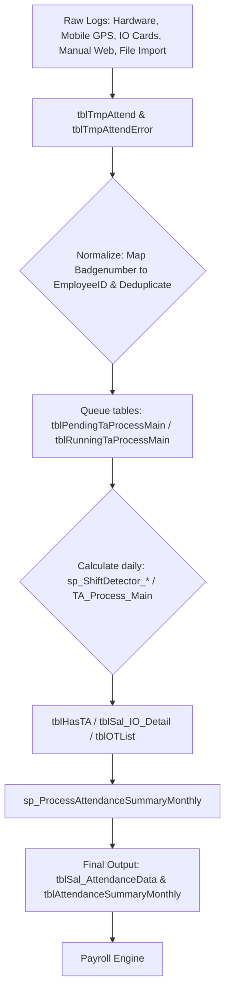

# 05 — Database: Attendance Pipeline

Reference: [04_db_biometric.md](04_db_biometric.md) (`USERINFO` mapping), [09_workflow_payroll.md](09_workflow_payroll.md) (Payroll ingestion).

## 1. Core Log Table: `CHECKINOUT`
Raw logs pushed from physical machines.
*   **Composite Primary Key**: `USERID` (maps to `USERINFO.USERID`), `CHECKTIME`, `CHECKTYPE` (`'I'` = In, `'O'` = Out).
*   **Key Columns**: `VERIFYCODE` (verification method), `SENSORID` (reader ID), `CardNo` (card number), `PhotoImage` (snap image), `temperature`, `maskflag`, `sn` (machine serial number).

## 2. Five Channels of Attendance
1.  **Hardware Terminals**: Biometrics mapped from ZKTeco (`TEMPLATE`, `FaceTemp`, `PalmTemp`) or Card (`CardNo`), or Pin (`USERINFO.PASSWORD`).
2.  **Mobile ESS App**: Controlled via `tblParameter`:
    *   `MOBILE_AUTO_ATT_OPT`: 1 = Auto check-in within GPS/Wifi range.
    *   `mobileatt_yeucauchamcongwifi`: 1 = Wifi SSID constraint active.
    *   `mobileatt_khoangcachchamcong`: GPS radius in meters.
    *   `mobileatt_trungkhopkhonmat`: 1 = Facial verification required.
    *   *Procedures*: `get_mobileatt_GPS` queries company location settings in `tblGPSOptionData`.
3.  **IO Cards / Access Control**: Logs stored in `tblAttendance_IOCard` (`IODate`, `EmployeeID`, `IOCardID`, `ReplaceDate`).
4.  **Web / Manual Entries**:
    *   `tblAttendanceConfirmRequest` / `tblAttendanceConfirmRequest_detail`: Request and details for forgot/error corrections.
    *   `tblInsertAttendanceTime` / `tblCustomAttendanceData`: Manual HR/Admin entries.
5.  **Legacy MS Access Import**:
    *   *Config*: `AttCheckInOut_AccessFileName` (MDB path), `AttCheckInOut_Access_Query` (custom SQL query), `AttCheckInOut_AccessFileName_Password`. Queued via `tblPendingImportAttend` / `tblRunningImportAttend`.

*Other specialized tables*: `tblMealAttendance` (cafeteria logs), `tblAttendanceRecord_MZH` (3rd party sync).

## 3. Data Staging & Calculation Fact Tables
*   **`tblTmpAttend`**: Gateway staging table consolidating raw logs from all 5 channels.
    *   *Key Columns*: `AttTime`, `EmployeeID` (mapped from `USERID`), `AttState`, `Latitude`, `Longitude`, `SSID`, `BSID` (mobile info), and pipeline flags (`Process`, `ProcessConvert`, `isImported`, `IsUse`).
*   **`tblHasTA`**: Central daily attendance fact table. Links raw logs with employee shifts.
    *   *Key Columns*: `EmployeeID`, `AttDate`, `Period` (Composite PK), `AttStart`, `AttEnd`, `AttMiddle` (assigned shifts times), `WorkingTime`, `RealWorkingTime`, `WorkingTimeApproved`, `Approve`, `TAStatus`, `NoTAReasonCode`, `isNS` (night shift), `isMinusMaternity`, `EmployeeStatusID`.
*   **`tblAttendanceSummaryMonthly`** & **`tblSal_AttendanceData`**: Monthly summaries and chot data finalized for payroll (`SALCAL_MAIN`).

## 4. Pipeline Execution Flow


*Pipeline flags in `tblTmpAttend`*: `Process = 0` (Pending), `Process = 1` (Processed), `ProcessConvert = 1` (Converted to `tblSal_*`), `isImported = 1` (External source), `IsUse` (Row active/valid).

## 5. Summary of Pipeline Staged Execution
| Step | DB Component | Action |
|---|---|---|
| 1. Collect | `CHECKINOUT`, `tblTmpAttend`, `tblAttendance_IOCard`, `tblInsertAttendanceTime` | Consolidation of raw logs. |
| 2. Standardize | `tblTmpAttend`, `RemoveDuplicateAttTime_Interval` | Map to EmployeeID, remove duplicates within interval, validate GPS/Wifi. |
| 3. Queue | `tblPendingTaProcessMain`, `tblRunningTaProcessMain` | Enqueue `EmployeeID` + `Date` pairs. |
| 4. Shift Detection| `sp_ShiftDetector_*`, `tblWSchedule`, `tblShiftSetting` | Match schedule with shifts. |
| 5. Compute Days | `TA_Process_Main`, `tblHasTA` | Map raw ins/outs against ca to generate daily facts. |
| 6. Compute Detail | `TA_Calculate_WorkingTime`, `TA_Process_InLateOutEarly`, `TA_ProcessMain_ROUND_*` | Refine night shifts, late-in/early-out, OT. |
| 7. Monthly Agg | `sp_ProcessAttendanceSummaryMonthly`, `tblAttendanceSummaryMonthly` | Compile monthly aggregations. |
| 8. Close Gate | `tblSal_AttendanceData` | Freeze data for calculation. |
| 9. Compute Pay | `SALCAL_MAIN` | Ingest frozen data to calculate final pay components. |

## 6. Critical Parameters (`tblParameter`)
*   `SAL_START` / `SAL_STOP`: Attendance/Salary cycle boundaries (e.g. 10th to 9th).
*   `RemoveDuplicateAttTime_Interval`: Time gap (seconds) to ignore subsequent duplicate card swipes.
*   `SaveLogsInsertExiststblTmpAttend`: Toggle for scanning only new logs vs full sync.
*   `ROUND_ATTDAYS`: Rounding rules for paid attendance days.

## 7. Diagnostic SQL Queries
Avoid `SELECT *` due to heavy photo columns.
```sql
-- 1. Pending raw records count
SELECT COUNT(*) AS PendingRaw FROM tblTmpAttend WHERE ISNULL(Process, 0) = 0;

-- 2. History for a single employee
SELECT AttTime, AttState, MachineNo, Latitude, Longitude, Process, ProcessConvert
FROM tblTmpAttend
WHERE EmployeeID = N'<EmployeeID>' AND AttTime BETWEEN '2026-05-01' AND '2026-05-31'
ORDER BY AttTime;

-- 3. Invalidate/Error records log
SELECT TOP 100 AttTime, EmployeeID, AttState, Shift, Process, ProcessConvert
FROM tblTmpAttendError ORDER BY AttTime DESC;
```
