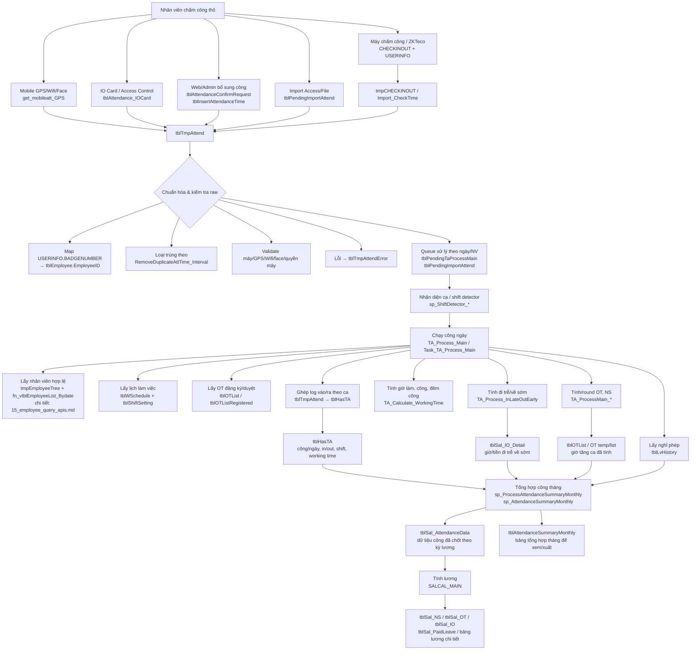

# 05 — Database: Chấm công (Attendance) — 5 kênh + pipeline raw → công

> Schema chấm công + pipeline xử lý raw → công ngày → tổng hợp tháng → input cho payroll. Liên quan: [04_db_biometric.md](04_db_biometric.md) (`USERINFO` định danh máy), [09_workflow_payroll.md](09_workflow_payroll.md) (giai đoạn 1 + 3 dùng output từ pipeline này).

Hệ thống hỗ trợ **5 kênh chấm công**, tất cả đẩy về log gốc `CHECKINOUT` (chuẩn ZKTeco) hoặc các bảng chấm công chuyên dụng.

## Bảng log gốc — `CHECKINOUT`

| Cột | Ý nghĩa |
|---|---|
| `USERID` (PK) | Link `USERINFO.USERID` → nhân viên qua `BADGENUMBER` |
| `CHECKTIME` (PK) | Thời điểm chấm |
| `CHECKTYPE` (PK) | `'I'` = In, `'O'` = Out |
| `VERIFYCODE` | Phương thức xác minh trên máy (vân tay / khuôn mặt / palm / card / password) |
| `SENSORID` | ID đầu đọc |
| `CardNo` | Số thẻ (nếu chấm bằng thẻ) |
| `PhotoImage` | Ảnh chụp lúc chấm (snapshot từ camera) |
| `temperature` | Nhiệt độ đo (máy có cảm biến) |
| `maskflag` | Có đeo khẩu trang hay không |
| `sn` | Serial máy chấm công |
| `WorkCode`, `Memoinfo`, `UserExtFmt` | Mã công việc / ghi chú / format mở rộng |

## Kênh 1 — Máy chấm công cứng (Hardware terminal)

Phương thức xác minh (xem [04_db_biometric.md](04_db_biometric.md)):
- **Vân tay** — template ở `TEMPLATE`
- **Khuôn mặt** — template ở `FaceTemp`
- **Lòng bàn tay** — template ở `Palm` / `PalmTemp`
- **Thẻ từ** — `CardNo` ở `USERINFO`
- **Mật khẩu** — `USERINFO.PASSWORD`, `MVerifyPass`

## Kênh 2 — Mobile app (Android + iOS) — ESS

Cấu hình qua `tblParameter`:

| Code | Ý nghĩa |
|---|---|
| `MOBILE_AUTO_ATT_OPT` | `1` = bật tự động khi vào vùng Wifi/GPS thiết lập |
| `mobileatt_yeucauchamcongwifi` | `1` = phải đúng tên Wifi |
| `mobileatt_khoangcachchamcong` | Bán kính GPS (mét) |
| `mobileatt_vitrichinhxac` | `1` = bắt buộc đúng vị trí |
| `MOBILE_MANUAL_ATT_OPT` | `1` chụp ảnh / `2` bấm giờ không ảnh / `3` cả hai |
| `MOBILE_MANUAL_ATT_BASIC_OPT` | Tương tự, dùng khi tự động + thủ công đều tắt |
| `mobileatt_trungkhopkhonmat` | `1` = bắt buộc khớp khuôn mặt mới được chấm |
| `mobileatt_thoigianchamcong` | Khoảng cách giây giữa các lần chấm |
| `mobileatt_xacnhancong` | `1` = hiển thị nút xác nhận trước khi chấm |
| `GPS_KEY`, `GPS_KEY_MAP` | API key map (lấy địa chỉ/bản đồ) |

Procedure: `get_mobileatt_GPS`. Cấu hình vị trí công ty: `tblGPSOptionData`.

## Kênh 3 — Thẻ ra/vào (IO Card / Access Control)

Bảng `tblAttendance_IOCard` (`IODate`, `EmployeeID`, `IOCardID`, `Note`, `ReplaceDate`) — chấm bằng thẻ ở cửa kiểm soát. Có cơ chế thay thẻ qua `ReplaceDate`.

## Kênh 4 — Web nhập thủ công / xác nhận

| Bảng | Mục đích |
|---|---|
| `tblAttendanceConfirmRequest`, `tblAttendanceConfirmRequest_detail` | Đơn yêu cầu xác nhận khi quên chấm / máy hỏng |
| `tblInsertAttendanceTime` | Admin/HR insert thời gian chấm thủ công |
| `tblCustomAttendanceData` | Dữ liệu chấm công tuỳ biến |

## Kênh 5 — Import từ file MS Access (legacy / hệ thống cũ)

Khi khách đã có hệ thống chấm công cũ chạy trên Access:

| Code | Ý nghĩa |
|---|---|
| `AttCheckInOut_AccessFileName` | Đường dẫn file `.mdb` |
| `AttCheckInOut_Access_Query` | Câu SQL đọc data (mỗi khách hàng schema khác nhau) |
| `AttCheckInOut_AccessFileName_Password` | Mật khẩu file Access |

Bảng phụ trợ: `tblPendingImportAttend`, `tblRunningImportAttend` (queue import).

## Kênh chuyên biệt khác

- `tblMealAttendance` — chấm công tại nhà ăn (cấp suất ăn).
- `tblAttendanceRecord_MZH` — tích hợp dữ liệu chấm công từ hệ thống ngoài (suffix `_MZH` = nhà cung cấp/tích hợp riêng).

## Bảng định nghĩa loại chấm công

`tblAttendanceType` (`AttTypeID`, `AttTypeName`, `AttTypeNameEN`) — master loại chấm công, hiện đang rỗng ở DB này.

## Cấu hình & xử lý raw → công

| Bảng | Vai trò |
|---|---|
| **`tblTmpAttend`** | **Bảng staging gateway** — gom data raw từ MỌI nguồn (máy, mobile, import). PK (`AttTime`, `EmployeeID`, `AttState`, `MachineNo`). Khác `CHECKINOUT` ở chỗ dùng `EmployeeID` thật (không phải `USERID`) và có thêm cột mobile (`Latitude`, `Longitude`, `SSID`, `BSID`) + flag pipeline (`Process`, `ProcessConvert`, `isImported`, `IsUse`). Đang được >20 procedure tham chiếu (`Import_CheckTime`, `Raw_AttendanceData_Bydate*`, `sp_API_GetAttCheckin`, `api_getDataCheckInOutGPS`, `API_AttendanceList`, `sp_ApproveAttendanceRequest`, `ProcessNoti_RemindCheckInOut`...). |
| `tblTmpAttendError` | Lưu raw record bị lỗi khi xử lý (PK `AttTime` + `EmployeeID`) |
| `tmpCHECKINOUT` | Tạm trước khi merge vào `CHECKINOUT` |
| `tblPendingTaProcessMain`, `tblRunningTaProcessMain` | Queue xử lý raw → công/OT |
| **`tblHasTA`** | **Bảng công ngày/trung gian cực quan trọng** sau khi đã ghép log raw với ca làm việc. PK (`EmployeeID`, `AttDate`, `Period`). Lưu `AttStart`, `AttEnd`, `WorkingTime`, `RealWorkingTime`, `Approve`, `NoTAReasonCode`, `isNS`, `TAStatus`, `EmployeeStatusID`, `AttMiddle`. Đây là lớp dữ liệu giữa `tblTmpAttend` và tổng hợp tháng/payroll; được nhiều procedure đọc/ghi như `TA_Process_Main`, `TA_Calculate_WorkingTime`, `TA_Process_InLateOutEarly`, `sp_AttendanceSummaryMonthly`, `sp_ProcessAttendanceSummaryMonthly`, `sp_ShiftDetector`, các báo cáo daily/monthly. |
| `tblSal_AttendanceData`, `tblSal_AttendanceData_Retro` | Dữ liệu công đã chốt cho tính lương |
| `tblSal_IO_Detail` | Chi tiết giờ vào/ra |
| `tblAttendanceSummaryMonthly` | Tổng hợp công tháng (cột `AttDays`, `NS_Hour_1-4`, `OT_ND_D/N`, `OT_WK_D/N`, `OT_PH_D/N`, `AL`, `SL*`, `ML`, `PH`...) |
| `tblAttendanceAllSetting` | Tham số chấm công tổng |
| `tblEmployeeTAOptions` | Tuỳ chọn chấm công per-employee |
| `tblEmployeeAccessMachine`, `tblDepartmentAccessMachine` | Phân quyền nhân viên/phòng ban được chấm trên máy nào |

## Vai trò riêng của `tblHasTA`

`tblHasTA` không phải raw log và cũng chưa phải dữ liệu payroll cuối cùng. Bảng này là **fact table công ngày**: mỗi dòng biểu diễn kết quả đã ghép log chấm công với ca/lịch cho một nhân viên trong một ngày/kỳ (`Period`). Vì vậy, khi kiểm tra vì sao công tháng hoặc lương sai, thường cần trace theo thứ tự:

```text
tblTmpAttend  →  tblHasTA  →  tblSal_AttendanceData / tblAttendanceSummaryMonthly  →  SALCAL_MAIN
```

Các nhóm cột chính:

| Nhóm | Cột tiêu biểu | Ý nghĩa |
|---|---|---|
| Khóa ngày công | `EmployeeID`, `AttDate`, `Period` | Định danh công của nhân viên theo ngày/kỳ. |
| Giờ vào/ra đã ghép | `AttStart`, `AttEnd`, `AttMiddle` | Giờ vào/ra sau khi hệ thống ghép log raw theo ca. |
| Giờ công | `WorkingTime`, `RealWorkingTime`, `WorkingTimeApproved` | Giờ làm tính toán và trạng thái duyệt giờ công. |
| Trạng thái công | `Approve`, `TAStatus`, `NoTAReasonCode`, `TimeReason` | Trạng thái duyệt, lý do không có công/lý do giờ công. |
| Thông tin xử lý đặc biệt | `isNS`, `isMinusMaternity`, `EmployeeStatusID`, `ContructionID` | Đêm công, thai sản, trạng thái nhân viên, công trình. |

## Pipeline luồng raw → công → tổng hợp tính lương



Ý nghĩa cờ trong `tblTmpAttend`:
- `Process = 0` → record raw chưa xử lý.
- `Process = 1` → đã xử lý vào pipeline.
- `ProcessConvert = 1` → đã convert sang format `CHECKINOUT`/`tblSal_*`.
- `isImported = 1` → đã import từ nguồn ngoài (file Access...).
- `IsUse` → record có dùng hay đã ignore (vd: trùng lặp đã merge).

Các bước xử lý chính đã xác minh từ DB:

| Bước | Bảng/procedure | Mô tả |
|---|---|---|
| 1. Gom raw | `CHECKINOUT`, `tblTmpAttend`, `tmpCHECKINOUT`, `tblAttendance_IOCard`, `tblInsertAttendanceTime` | Thu thập log thô từ máy, mobile, thẻ cửa, web/admin, import. |
| 2. Chuẩn hóa raw | `tblTmpAttend`, `tblTmpAttendError`, `RemoveDuplicateAttTime_Interval` | Quy về `EmployeeID`, loại log trùng/lỗi, lưu thông tin GPS/Wifi/ảnh nếu có. |
| 3. Queue xử lý | `sp_InsertPendingProcessAttendanceData`, `sp_taProcesssMainQueue`, `tblPendingTaProcessMain`, `tblRunningTaProcessMain` | Đưa từng cặp `EmployeeID` + `Date` cần tính vào hàng đợi. |
| 4. Nhận diện ca | `sp_ShiftDetector_*`, `tblWSchedule`, `tblShiftSetting` | Xác định ca/lịch làm việc đúng cho từng ngày. |
| 5. Tính công ngày | `TA_Process_Main`, `Task_TA_Process_Main`, `tblHasTA` | Ghép log vào/ra, nghỉ phép, OT, lịch làm việc để tạo dữ liệu công ngày. |
| 6. Tính chi tiết | `TA_Calculate_WorkingTime`, `TA_Process_InLateOutEarly`, `TA_ProcessMain_ROUND_NS`, `TA_ProcessMain_ROUND_OT`, `TA_ProcessMain_Finish_OTCalculator` | Tính giờ làm, ngày công, đêm công, đi trễ/về sớm, OT và làm tròn. |
| 7. Tổng hợp tháng | `sp_ProcessAttendanceSummaryMonthly`, `sp_AttendanceSummaryMonthly`, `sp_AttendanceSummaryMonthly_Insert` | Tổng hợp dữ liệu ngày/nghỉ/OT/IO thành dữ liệu tháng. |
| 8. Dữ liệu cho payroll | `tblSal_AttendanceData`, `tblAttendanceSummaryMonthly` | `tblSal_AttendanceData` là nguồn công cho `SALCAL_MAIN`; `tblAttendanceSummaryMonthly` là bảng tổng hợp để xem/xuất. |
| 9. Tính lương | `SALCAL_MAIN` | Đọc `tblSal_AttendanceData` và sinh các khoản `tblSal_NS`, `tblSal_OT`, `tblSal_IO`, `tblSal_PaidLeave`... |

## Tham số xử lý quan trọng (`tblParameter`)

- `SAL_START` — ngày bắt đầu chu kỳ tính công/lương (hiện tại = 10).
- `SAL_STOP` — ngày kết thúc chu kỳ tính công/lương (hiện tại = 9).
- `RemoveDuplicateAttTime_Interval` — loại bỏ lần bấm trùng trong N giây.
- `SaveLogsInsertExiststblTmpAttend` — chỉ tải data mới từ máy hay tải lại hết (liên quan trực tiếp `tblTmpAttend`).
- `ATT_SHOWTIMEINOUT` — chế độ hiển thị bảng công tổng hợp (giờ in/out hay tổng giờ làm).
- `ROUND_ATTDAYS` — làm tròn ngày công hưởng lương.
- `PhotoImageUsedForAttRegFace` — dùng ảnh đăng ký face làm ảnh hồ sơ.
- `HAFT_DAY_ATT_OPTION` — cách tính khi nghỉ nửa buổi.

## Câu SQL mẫu — kiểm tra trạng thái pipeline

```sql
-- 1. Số record raw chưa xử lý
SELECT COUNT(*) AS PendingRaw
FROM tblTmpAttend
WHERE ISNULL(Process, 0) = 0;

-- 2. Lịch sử chấm công 1 nhân viên trong khoảng ngày
SELECT AttTime, AttTimeDevice, AttState, MachineNo, sn,
       VERIFYCODE, CardNo,
       Latitude, Longitude, SSID,   -- mobile-only fields
       Process, ProcessConvert, isImported
FROM tblTmpAttend
WHERE EmployeeID = N'<EmployeeID>'
  AND AttTime BETWEEN '2025-01-01' AND '2025-01-31'
ORDER BY AttTime;

-- 3. Record lỗi (chưa xử lý được)
SELECT TOP 100 AttTime, EmployeeID, AttState, MachineNo, Shift, Process, ProcessConvert
FROM tblTmpAttendError
ORDER BY AttTime DESC;

-- 4. Phân loại nguồn chấm công trong tblTmpAttend (heuristic)
SELECT
  CASE
    WHEN Latitude IS NOT NULL OR Longitude IS NOT NULL OR SSID IS NOT NULL THEN 'Mobile'
    WHEN sn IS NOT NULL AND sn <> '' THEN 'Hardware terminal'
    ELSE 'Other (Web/Import)'
  END AS Source,
  COUNT(*) AS Cnt
FROM tblTmpAttend
GROUP BY
  CASE
    WHEN Latitude IS NOT NULL OR Longitude IS NOT NULL OR SSID IS NOT NULL THEN 'Mobile'
    WHEN sn IS NOT NULL AND sn <> '' THEN 'Hardware terminal'
    ELSE 'Other (Web/Import)'
  END;
```

## Phân ca đào tạo và PIC chấm công theo ngày

Menu Chi tiết nhân sự & phân ca sử dụng:

- `tblTrainingStatus.AttendancePIC`: `EmployeeID` của PIC mặc định theo từng trạng thái đào tạo.
- `tblWSchedule.TrainingStatusID`: trạng thái đào tạo của lịch từng ngày.
- `tblWSchedule.AttendancePICEmployeeID`: PIC override cho riêng ngày đó; nếu `NULL` thì UI dùng PIC mặc định từ trạng thái.

Quy tắc tạo lịch tự động full khoảng:

- `RequestedDays` là tổng số bản ghi lịch mong muốn trong `FromDate`–`ToDate`, không phải số bản ghi luôn chèn thêm.
- Bản ghi đã tồn tại được tính vào tổng và không chèn trùng.
- Tạo lịch tự động reset bộ đếm tại `FromDate` của khoảng quản lý được chọn. Trong chính khoảng đó, khi một ca dự kiến tạo thành ngày làm liên tục thứ 7, hệ thống không xếp tại ngày vi phạm và dời chính ca này sang ngày kế tiếp còn hợp lệ; không tạo bản ghi `OFF`.
- `FromDate` và `ToDate` phải cùng tháng, cùng năm. AutoSchedule không được tạo dữ liệu ngoài `ToDate` hoặc tràn sang tháng kế tiếp. Nếu khoảng lọc vượt tháng/năm thì trả lỗi `Khoảng thời gian phân ca phải nằm trong cùng một tháng.` trước khi ghi dữ liệu.
- Procedure phải lập đủ kế hoạch trong khoảng đã chọn rồi mới INSERT; nếu không đủ ngày hợp lệ thì không lưu một phần.
- Tạo/sửa lịch thủ công: nếu ngày đang lưu tạo thành chuỗi 7 ngày làm liên tục thì trả lỗi cứng và không ghi dữ liệu.
- Kết quả API tách `InsertedWorkingRows`, `InsertedOffRows`, `InsertedRows`, `FromDate`, `ToDate` để UI chỉ báo thành công khi DB thực sự chèn dữ liệu.

Ví dụ: chọn tháng 07/2026 và yêu cầu 7 ngày làm thì tạo ngày 01–06/07, không tạo ngày 07/07 và dời ca làm thứ 7 sang ngày 08/07. Lịch trước ngày 01/07 không làm thay đổi vị trí nghỉ của đợt tạo tự động này.
