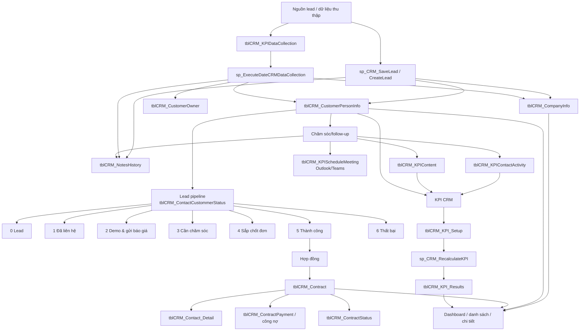

# 08 — Workflow: Module CRM (lead → khách hàng → hợp đồng → KPI)

> Module CRM của ParadiseHR. Liên quan: [07_menu_system.md](07_menu_system.md) (nhiều menu CRM dùng HTML cache pattern), [10_workflow_performance.md](10_workflow_performance.md) (KPI CRM là 1 trong 5 hệ đánh giá).

Module CRM trong DB hiện dùng nhóm bảng/procedure tiền tố `tblCRM_*`, `sp_CRM_*` và một số procedure `sp_KPI*`, `sp_ExecuteDateCRMDataCollection`. CRM được thiết kế theo hướng **lead → chăm sóc/follow-up → khách hàng/công ty → hợp đồng/công nợ → KPI sales/CRM**.

## Nhóm bảng chính

| Nhóm | Bảng/procedure | Vai trò |
|---|---|---|
| Công ty | `tblCRM_CompanyInfo` | Master công ty/đơn vị khách hàng. Khóa `Company_ID`; có `TaxCode`, `Company`, `Industry_ID`, `CompanySize_ID`, `Source`, `StatusID`, địa chỉ bill/ship. |
| Người liên hệ/lead | `tblCRM_CustomerPersonInfo` | Master người liên hệ/lead. Khóa `CRM_CustomerID`; gắn `CRM_CompanyID`, `OwnerID`, `StatusID`, phone/email/Zalo. |
| Owner sales | `tblCRM_CustomerOwner` | Gán khách hàng cho nhân viên phụ trách; PK kép `CRM_CustomerID`, `OwnerID`, cờ `IsPrimary`. |
| Pipeline status | `tblCRM_ContactCustommerStatus` | Danh mục trạng thái lead: Lead, Đã liên hệ, Demo & báo giá, Cần chăm sóc, Sắp chốt đơn, Thành công, Thất bại, Dữ liệu thu thập. |
| Ghi chú/lịch sử | `tblCRM_NotesHistory` | Timeline ghi chú, trao đổi, file/ticket/chat theo customer/company. |
| Hợp đồng | `tblCRM_Contract`, `tblCRM_Contact_Detail`, `tblCRM_ContractType`, `tblCRM_ContractStatus`, `tblCRM_ContractPayment` | Quản lý hợp đồng, chi tiết sản phẩm/dịch vụ, trạng thái và thanh toán/công nợ. |
| KPI CRM | `tblCRM_KPI_Setup`, `tblCRM_KPI_Results`, `tblCRM_KPICategories`, `tblCRM_Category_TimeUnits` | Cấu hình chỉ tiêu, tính kết quả KPI, điểm/coin sales. |
| Hoạt động KPI | `tblCRM_EmailKPI`, `tblCRM_KPIDataCollection`, `tblCRM_KPIContactActivity`, `tblCRM_KPIContent`, `tblCRM_KPIScheduleMeeting` | Nguồn dữ liệu đo KPI: email, data collection, liên hệ khách, nội dung marketing, lịch meeting. |
| UI HTML cache | `sp_CRM_*_html`, `tblHtmlScriptCache` | Nhiều màn CRM dùng WebView HTML tương tự màn `Xếp hạng nhân viên` (xem [07_menu_system.md](07_menu_system.md)). |

## Trạng thái pipeline khách hàng

`tblCRM_ContactCustommerStatus` đang định nghĩa:

| Status | Tên VN | Ý nghĩa |
|---:|---|---|
| 7 | Dữ liệu thu thập | Data collection thô, chưa chuyển thành lead tiềm năng. |
| 0 | Lead | Lead mới/potential customer. |
| 1 | Đã liên hệ | Sales đã liên hệ. |
| 2 | Đã demo & gửi báo giá | Đã demo/gửi quotation. |
| 3 | Cần chăm sóc | Cần follow-up/chăm sóc thêm. |
| 4 | Sắp chốt đơn | Deal closing. |
| 5 | Thành công | Chốt thành công. |
| 6 | Thất bại | Deal thất bại. |

## Lưu đồ tổng thể



## Quy trình chi tiết

1. **Tạo nguồn lead/data collection**
   - Lead có thể được tạo từ form CRM (`sp_CRM_CreateLead` render HTML, `sp_CRM_SaveLead` lưu dữ liệu) hoặc từ data collection (`tblCRM_KPIDataCollection`, `sp_ExecuteDateCRMDataCollection`).
   - Khi insert data collection, nếu `@isPotential = 1` thì người liên hệ được đưa vào trạng thái `StatusID = 0` (Lead); nếu không thì `StatusID = 7` (Dữ liệu thu thập).
   - Nếu `TaxCode = 'auto'`, hệ thống tự sinh mã tax code dạng `99...01`.

2. **Chuẩn hóa công ty và người liên hệ**
   - `sp_CRM_SaveLead` / `sp_ExecuteDateCRMDataCollection` kiểm tra công ty theo `TaxCode`.
   - Nếu đã có `tblCRM_CompanyInfo` thì update thông tin; nếu chưa có thì insert công ty mới.
   - Sau đó insert `tblCRM_CustomerPersonInfo`; có logic chống trùng theo `PhoneNumber`/`PhoneNumber1`.
   - Lead chưa xác định công ty có thể tạo **virtual company** với `Company_ID` âm.

3. **Gán owner phụ trách**
   - Owner chính lưu ở `tblCRM_CustomerPersonInfo.OwnerID` và/hoặc bảng nhiều-nhiều `tblCRM_CustomerOwner`.
   - `tblCRM_CustomerOwner.IsPrimary = 1` đánh dấu nhân viên phụ trách chính.
   - Danh sách lead (`sp_CRM_LeadList`) lọc theo quyền nhân viên qua `sp_getEmployeeListWithPermission`, chỉ thấy lead thuộc owner được phép hoặc lead chưa có owner.

4. **Chăm sóc và cập nhật pipeline**
   - Trạng thái lead nằm ở `tblCRM_CustomerPersonInfo.StatusID` theo `tblCRM_ContactCustommerStatus`.
   - Ghi chú/timeline lưu `tblCRM_NotesHistory`; các tab chi tiết gọi nhóm procedure `sp_CRM_LoadCustomerDetail_*` để load tổng quan, ghi chú, hoạt động, liên hệ, hỗ trợ, công nợ.
   - Hoạt động liên hệ có thể ghi vào `tblCRM_KPIContactActivity`.
   - Lịch meeting dùng `tblCRM_KPIScheduleMeeting`, có procedure tích hợp Outlook/Teams như `sp_CRMCreateOutlookEvent`, `sp_CRMUpdateOutlookEventByMeetID`.
   - Nội dung marketing/KPI content lưu ở `tblCRM_KPIContent`.

5. **Chốt deal và hợp đồng**
   - Khi khách hàng đi tới trạng thái thành công (`StatusID = 5`) hoặc đã chốt, sales tạo hợp đồng bằng `sp_CRM_AddContract` / `sp_CRM_SaveContract`.
   - Header hợp đồng lưu `tblCRM_Contract`: `CustomerID`, `ContractID` (loại HĐ), `StartDay`, `EndDate`, `Cost`, `IsClosed`, `Status`, `CreatedBy`.
   - Chi tiết sản phẩm/dịch vụ lưu `tblCRM_Contact_Detail` qua `sp_UpdateorInsertDetailContract`.
   - Loại hợp đồng nằm ở `tblCRM_ContractType`; trạng thái hợp đồng/thanh toán nằm ở `tblCRM_ContractStatus` và các procedure công nợ như `sp_CRM_SaleFinalized_congno`, `sp_CRM_RequestCancelPayment_congno`, `sp_CRM_FullPaymentCustomerDetail_congno`.
   - `sp_CRM_GetCustomerList` tính trạng thái hợp đồng theo `EndDate`: quá hạn, sắp tới hạn 30 ngày, còn hiệu lực.

6. **KPI CRM / sales**
   - Cấu hình chỉ tiêu nằm ở `tblCRM_KPI_Setup`: nhân viên KPI (`NVKPI_ID`), loại KPI (`KPI_ID`), đơn vị thời gian (`DVT_ID`), chỉ tiêu yêu cầu, điểm kinh nghiệm, coin, bonus.
   - `sp_CRM_RecalculateKPI` lấy cấu hình hiệu lực mới nhất theo `EffectiveDate`, sinh period bằng `fn_GetPeriodsByTimeUnit`, rồi tính KPI thực tế.
   - Logic đã xác minh trong procedure:
     - `KPI_ID = 1`: số email thủ công từ `tblCRM_EmailKPI` theo `EmployeeID` và `ReceivedTime`.
     - `KPI_ID = 2`: dữ liệu thu thập/lead từ `tblCRM_CustomerPersonInfo`, join `tblCRM_CustomerOwner` với `IsPrimary = 1`, theo `CreatedDate`.
   - Kết quả ghi `tblCRM_KPI_Results`: `KPI_Actual`, `Achievement_Percent`, `Is_Achieved`, `ExperiencePoints_Earned`, `Coin_Earned`, `Bonus_ExperiencePoints`, `Bonus_Coin`, `Notes`.

7. **Dashboard/báo cáo/UI**
   - Dashboard và danh sách dùng các procedure như `sp_CRMDashboard`, `sp_CRM_GetCustomerList`, `sp_CRM_LeadList`, `sp_CRM_CustomerDetail`, `sp_CRM_ListFollowUp`, `sp_CRM_SalesApproved`, `sp_Debt_ListCustomerDebt`.
   - Nhiều màn hình CRM render bằng HTML cache: procedure wrapper `sp_CRM_*` chỉ trả `html` từ `tblHtmlScriptCache`, còn JS trong HTML gọi các API/procedure dữ liệu runtime.

## SQL kiểm tra nhanh

```sql
-- Danh sách trạng thái pipeline CRM
SELECT *
FROM tblCRM_ContactCustommerStatus
ORDER BY Priority;

-- Lead/customer theo trạng thái
SELECT StatusID, COUNT(*) AS Cnt
FROM tblCRM_CustomerPersonInfo
GROUP BY StatusID
ORDER BY StatusID;

-- Công ty + người liên hệ + owner
SELECT TOP 50 c.Company_ID, c.TaxCode, c.Company,
       p.CRM_CustomerID, p.FullName, p.PhoneNumber, p.Email,
       p.StatusID, p.OwnerID, o.OwnerID AS OwnerInMap, o.IsPrimary
FROM tblCRM_CustomerPersonInfo p
LEFT JOIN tblCRM_CompanyInfo c ON c.Company_ID = p.CRM_CompanyID
LEFT JOIN tblCRM_CustomerOwner o ON o.CRM_CustomerID = p.CRM_CustomerID
ORDER BY p.CreatedDate DESC;

-- Hợp đồng còn hiệu lực / sắp hết hạn / quá hạn
SELECT TOP 50 ct.ID, ct.CustomerID, cp.FullName, co.Company,
       ct.ContractID, tp.ContactName, ct.StartDay, ct.EndDate, ct.Cost,
       CASE
         WHEN CAST(GETDATE() AS date) > ct.EndDate THEN N'Quá hạn'
         WHEN ct.EndDate BETWEEN CAST(GETDATE() AS date) AND DATEADD(DAY, 30, CAST(GETDATE() AS date)) THEN N'Sắp tới hạn'
         ELSE N'Còn hiệu lực'
       END AS ContractStatus
FROM tblCRM_Contract ct
LEFT JOIN tblCRM_CustomerPersonInfo cp ON cp.CRM_CustomerID = ct.CustomerID
LEFT JOIN tblCRM_CompanyInfo co ON co.Company_ID = cp.CRM_CompanyID
LEFT JOIN tblCRM_ContractType tp ON tp.ContractID = ct.ContractID
WHERE ISNULL(ct.IsClosed, 0) = 0
ORDER BY ct.EndDate;
```
