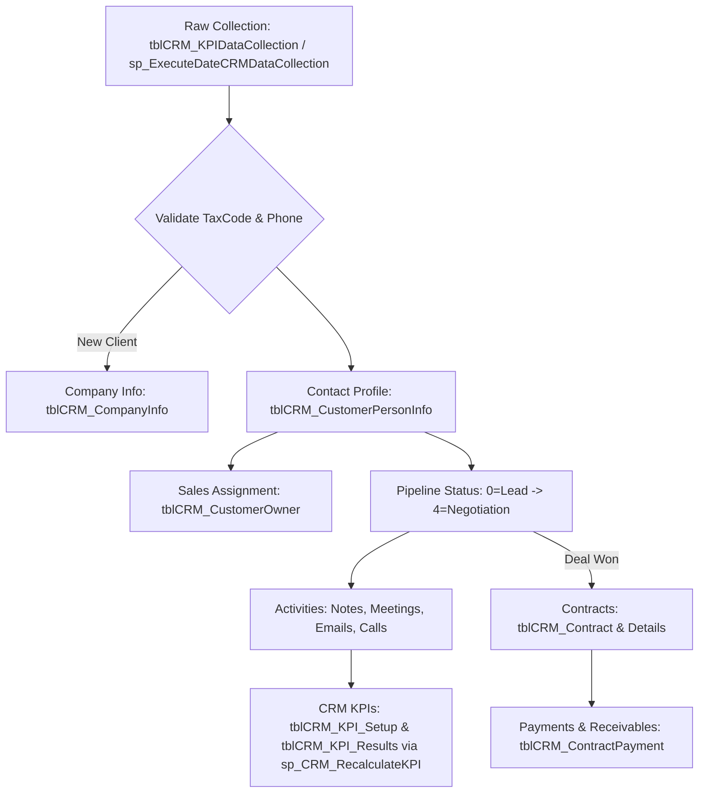

# 08 — Workflow: CRM Module

Reference: [07_menu_system.md](07_menu_system.md) (Menu wrappers/cache), [10_workflow_performance.md](10_workflow_performance.md) (KPI evaluation).

The CRM module manages the sales lifecycle: **Lead Collection -> Pipeline Nurturing -> Accounts & Contacts -> Contracts & Payments -> Sales KPIs & Performance**.

## 1. CRM Schema Architecture
| Entity Area | Primary DB Component | Table Role |
|---|---|---|
| **Accounts** | `tblCRM_CompanyInfo` | Corporate clients/accounts. Key fields: `TaxCode`, `Company`, `Industry_ID`, `CompanySize_ID`, `Source`, `StatusID`. |
| **Contacts** | `tblCRM_CustomerPersonInfo` | Leads and contact profiles. Key fields: `CRM_CompanyID`, `OwnerID`, `StatusID`, phone, email, Zalo. |
| **Assignments** | `tblCRM_CustomerOwner` | Sales assignments. Composite PK: `CRM_CustomerID` + `OwnerID`. `IsPrimary = 1` for primary owner. |
| **Pipeline** | `tblCRM_ContactCustommerStatus`| Status lookup: 0=Lead, 1=Contacted, 2=Demo/Quote, 3=Nurturing, 4=Negotiation, 5=Success, 6=Lost, 7=Collected (Unqualified). |
| **Activities** | `tblCRM_NotesHistory`<br/>`tblCRM_KPIContactActivity`<br/>`tblCRM_KPIContent`<br/>`tblCRM_KPIScheduleMeeting` | History tracking (timeline, tasks, calls, meeting schedules, marketing content). Meeting schedules support Teams/Outlook integration. |
| **Contracts** | `tblCRM_Contract`<br/>`tblCRM_Contact_Detail`<br/>`tblCRM_ContractPayment` | Sales contracts, line items, and payment schedules/receivables (`sp_CRM_*_congno`). |
| **KPIs** | `tblCRM_KPI_Setup`<br/>`tblCRM_KPI_Results`<br/>`tblCRM_KPICategories` | Goal setups (`KPI_ID`, `NVKPI_ID`, targets) and evaluated metrics (experience points, sales coins, bonuses). |

## 2. CRM Lifecycle Flow


## 3. Core Functional Logic
1.  **Lead Capture**: Enqueued via `tblCRM_KPIDataCollection`. Run `sp_ExecuteDateCRMDataCollection` to parse. If `@isPotential = 1` -> set `StatusID = 0` (Lead), else `StatusID = 7` (Collected Data). Matches existences by `TaxCode` and `PhoneNumber`. Auto-generates placeholder tax codes like `99...01`. Leads without companies use negative temporary `Company_ID` keys.
2.  **Access Filtering**: The lead directory (`sp_CRM_LeadList`) scopes records by Owner permissions (`sp_getEmployeeListWithPermission`).
3.  **Sales KPIs calculation**: Handled by `sp_CRM_RecalculateKPI` according to parameters in `tblCRM_KPI_Setup`.
    *   *KPI_ID = 1*: Count of emails sent (`tblCRM_EmailKPI`).
    *   *KPI_ID = 2*: Count of leads captured (`tblCRM_CustomerPersonInfo` primary assignments).
    *   Saves calculated metrics to `tblCRM_KPI_Results` (achievements, experience points, coins).

## 4. Diagnostics Queries
```sql
-- Pipeline Status Count
SELECT StatusID, COUNT(*) AS LeadCount
FROM tblCRM_CustomerPersonInfo GROUP BY StatusID ORDER BY StatusID;

-- Accounts, Contacts, and Primary Sales Owners
SELECT TOP 50 c.Company, p.FullName, p.PhoneNumber, p.Email, p.StatusID, o.OwnerID, o.IsPrimary
FROM tblCRM_CustomerPersonInfo p
LEFT JOIN tblCRM_CompanyInfo c ON c.Company_ID = p.CRM_CompanyID
LEFT JOIN tblCRM_CustomerOwner o ON o.CRM_CustomerID = p.CRM_CustomerID
ORDER BY p.CreatedDate DESC;

-- Contract Expiry Tracking
SELECT TOP 50 ct.CustomerID, cp.FullName, ct.StartDay, ct.EndDate, ct.Cost,
       CASE
         WHEN CAST(GETDATE() AS date) > ct.EndDate THEN N'Expired'
         WHEN ct.EndDate BETWEEN CAST(GETDATE() AS date) AND DATEADD(DAY, 30, CAST(GETDATE() AS date)) THEN N'Expiring in 30d'
         ELSE N'Active'
       END AS ContractStatus
FROM tblCRM_Contract ct
LEFT JOIN tblCRM_CustomerPersonInfo cp ON cp.CRM_CustomerID = ct.CustomerID
LEFT JOIN tblCRM_ContractType tp ON tp.ContractID = ct.ContractID
WHERE ISNULL(ct.IsClosed, 0) = 0 ORDER BY ct.EndDate;
```
