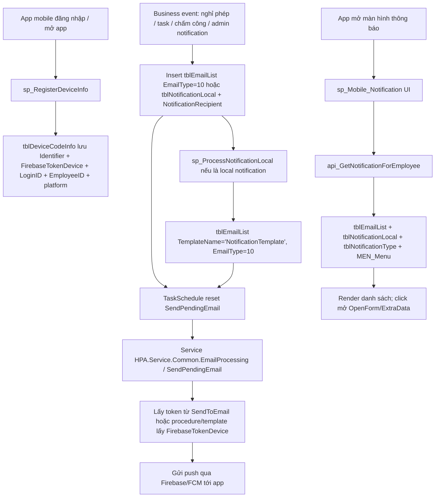

# 16 — Mobile Notification: cơ chế gửi thông báo tới app ParadiseHR

> File này tổng hợp cơ chế gửi thông báo tới ứng dụng ParadiseHR trên điện thoại, đã xác minh từ DB ngày 2026-05-21.
>
> Nguồn DB chính: `tblDeviceCodeInfo`, `tblEmailList`, `tblNotificationLocal`, `NotificationRecipient`, `tblNotificationType`, `TaskSchedule`, các procedure `sp_RegisterDeviceInfo`, `sp_ProcessNotificationLocal`, `api_GetNotificationForEmployee`, `sp_Mobile_Notification`, `sp_GetReceiverToken`, `sp_GetReceiverToken_byEmployeeID`, `sp_NotificationLocal_GetData`, `sp_Task_NotiApproval`, `sp_NotiInsertRegisteredLeave`, `sp_DailyAttendance_Notify`, `sp_RemindNoti`.

---

## 1. Kết luận nhanh

ParadiseHR gửi thông báo tới app mobile theo 2 lớp:

1. **Push notification thật ra thiết bị**: dùng `FirebaseTokenDevice` của thiết bị, lưu trong `tblDeviceCodeInfo`, sau đó tạo job trong `tblEmailList` với `EmailType = 10`. Service nền `SendPendingEmail` (`TaskSchedule.FunctionName = 'SendPendingEmail'`, `ClassName = 'HPA.Service.Common.EmailProcessing'`) xử lý queue này và gửi push.
2. **Danh sách thông báo trong app**: app mobile gọi API `api_GetNotificationForEmployee` để load danh sách thông báo từ `tblEmailList` và `tblNotificationLocal`, render bằng UI `sp_Mobile_Notification`.

Tên cột `SendToEmail` trong `tblEmailList` gây hiểu nhầm: với `EmailType = 10`, dữ liệu thực tế là **Firebase token**, không phải email address.

---

## 2. Đăng ký thiết bị và token push

### 2.1. Bảng thiết bị: `tblDeviceCodeInfo`

`tblDeviceCodeInfo` lưu mỗi thiết bị đăng nhập app/mobile/web theo `Identifier`.

Các cột quan trọng đã xác minh schema:

| Cột | Vai trò |
|---|---|
| `Identifier` | Định danh thiết bị, khoá logic khi đăng ký/cập nhật device |
| `FirebaseTokenDevice` | Token dùng để gửi push notification qua Firebase/FCM |
| `MqttTokenDevice` | Token MQTT nếu client gửi lên; chưa thấy luồng gửi chính dùng trong các proc đã kiểm tra |
| `ApnsTokenDevice` | Token APNS nếu client gửi lên; dữ liệu hiện tại chưa có token APNS, iOS cũng có `FirebaseTokenDevice` |
| `EmployeeID`, `LoginID`, `LoginName` | Mapping thiết bị với user/nhân viên |
| `platform` | `Android`, `iOS`, `Web` |
| `LastConnectingDate` | Mốc chọn thiết bị mới nhất khi lấy token gửi push |
| `DeviceCode`, `DeviceName`, `device`, `manufacturer`, `version`, `AppInfo*`, `IpWan`, `path` | Metadata thiết bị/app |

Query kiểm tra nhanh:

```sql
SELECT TOP 50
       platform,
       COUNT(*) AS DeviceCount,
       SUM(CASE WHEN FirebaseTokenDevice IS NOT NULL AND LEN(FirebaseTokenDevice) > 5 THEN 1 ELSE 0 END) AS HasFirebaseToken,
       SUM(CASE WHEN ApnsTokenDevice IS NOT NULL AND LEN(ApnsTokenDevice) > 5 THEN 1 ELSE 0 END) AS HasApnsToken,
       SUM(CASE WHEN MqttTokenDevice IS NOT NULL AND LEN(MqttTokenDevice) > 5 THEN 1 ELSE 0 END) AS HasMqttToken,
       MAX(LastConnectingDate) AS LastConnectingDate
FROM dbo.tblDeviceCodeInfo
GROUP BY platform
ORDER BY DeviceCount DESC;
```

Kết quả DB tại thời điểm kiểm tra:

| platform | DeviceCount | HasFirebaseToken | HasApnsToken | HasMqttToken |
|---|---:|---:|---:|---:|
| Web | 438 | 111 | 0 | 0 |
| iOS | 7 | 7 | 0 | 0 |
| Android | 7 | 7 | 0 | 0 |

### 2.2. Procedure đăng ký thiết bị: `sp_RegisterDeviceInfo`

`sp_RegisterDeviceInfo` nhận token và thông tin thiết bị từ app:

- `@Identifier`
- `@FirebaseTokenDevice`
- `@MqttTokenDevice`
- `@ApnsTokenDevice`
- `@LoginID`, `@LoginName`, `@EmployeeID`
- `@platform`, `@device`, `@manufacturer`, `@deviceName`, `@version`, `@AppInfo*`, `@IpWan`, `@path`

Luồng chính:

1. Nếu `@Identifier` rỗng thì return.
2. Lấy dòng hiện có trong `tblDeviceCodeInfo` theo `Identifier` vào `#Results`.
3. Nếu chưa có thì insert `Identifier`, `CreateTime` vào `#Results`.
4. Update các field trong `#Results`; chỉ ghi đè khi tham số truyền vào khác rỗng.
5. Gọi `sp_SaveData @TableNameTmp='#Results', @TableName='tblDeviceCodeInfo', @Command='insert,update'` để upsert.
6. Update `LastConnectingDate` bằng `dbo.fn_GetDate_VietNamese(GETDATE())`.
7. Nếu `@LoginID = -2` thì xoá thiết bị theo `Identifier`.

Query đọc source:

```sql
SELECT OBJECT_DEFINITION(OBJECT_ID(N'dbo.sp_RegisterDeviceInfo')) AS ProcDefinition;
```

---

## 3. Queue gửi push: `tblEmailList` với `EmailType = 10`

Bảng `tblEmailList` là queue chung cho gửi email/thông báo. Với push mobile, các dòng có:

| Cột | Ý nghĩa trong push mobile |
|---|---|
| `EmailType` | `10` = loại thông báo push/mobile trong dữ liệu thực tế |
| `TemplateName` | Tên template/procedure xử lý nội dung, ví dụ `sp_Task_NotiApproval`, `DailyAttendance_Notify`, `sp_NotiInsertRegisteredLeave`, `NotificationTemplate` |
| `SendStatus` | Trạng thái gửi; dữ liệu thực tế có `1` và `2` sau xử lý |
| `Approved_Send` | Thường `1` để cho phép gửi |
| `SendToEmployeeID` / `EmployeeID` | Nhân viên nhận / nhân viên liên quan |
| `SendToEmail` | Với `EmailType=10`, đang chứa `FirebaseTokenDevice` dài ~142 ký tự |
| `SendSubjectEmail`, `SendBodyEmail` | Tiêu đề/nội dung đã render hoặc nội dung phục vụ danh sách thông báo |
| `notificationID` | Link sang `tblNotificationLocal` với thông báo local/admin |
| `NotifycationStatusID` | Trạng thái read/unread khi app load danh sách |
| `LastUpdateTime`, `CreateTime`, `DateSend` | Thời điểm tạo/cập nhật/gửi |

Query kiểm tra queue push gần nhất:

```sql
SELECT TOP 20
       EmailID, TemplateName, SendStatus, EmployeeID, SendToEmployeeID,
       LEFT(SendToEmail, 30) AS SendToEmailPrefix,
       LEN(SendToEmail) AS SendToEmailLen,
       LEFT(SendSubjectEmail, 100) AS Subject,
       notificationID, LastUpdateTime
FROM dbo.tblEmailList
WHERE EmailType = 10
ORDER BY EmailID DESC;
```

Dữ liệu thực tế cho thấy `SendToEmailPrefix` có dạng token FCM như `...:APA91b...`, độ dài 142 ký tự.

### 3.1. Service xử lý queue

`TaskSchedule` có job active:

| FunctionName | ClassName | IsActive | Ghi chú |
|---|---|---:|---|
| `SendPendingEmail` | `HPA.Service.Common.EmailProcessing` | 1 | Service nền xử lý queue `tblEmailList` |

Procedure liên quan:

```sql
CREATE PROC [dbo].[SendPendingEmailCallFunction] AS
SELECT 'SendPendingEmail' FunctionName, 'HPA.Service.Common.EmailProcessing' ClassName
```

`sp_ProcessNotificationLocal` sau khi enqueue thông báo local có câu update ép job chạy sớm:

```sql
UPDATE TaskSchedule
SET LastTryDay = '2026-01-01', NextRunDate = '2026-01-01'
WHERE FunctionName = 'SendPendingEmail' AND IsActive = 1;
```

Nhiều proc khác cũng reset `TaskSchedule` tương tự để đẩy queue gửi ngay.

---

## 4. Cách lấy Firebase token người nhận

Các proc đã xác minh đều chọn thiết bị mới nhất theo `LastConnectingDate`.

### 4.1. `sp_GetReceiverToken`

Input: `@EmailID`.

Luồng:

1. Lấy `SendToEmployeeID` từ `tblEmailList`.
2. Join `tblSC_Login` với `tblDeviceCodeInfo` theo `LoginID`.
3. Lọc đúng `EmployeeID`, `FirebaseTokenDevice IS NOT NULL`, `LEN(FirebaseTokenDevice) > 5`.
4. `ORDER BY d.LastConnectingDate DESC`.
5. Trả `SELECT @FirebaseToken AS ToEmail`.

```sql
SELECT OBJECT_DEFINITION(OBJECT_ID(N'dbo.sp_GetReceiverToken')) AS ProcDefinition;
```

### 4.2. `sp_GetReceiverToken_byEmployeeID`

Input: `@EmployeeID`.

Giống `sp_GetReceiverToken`, nhưng nhận trực tiếp `EmployeeID` và trả `ToEmail` là token thiết bị mới nhất.

```sql
SELECT OBJECT_DEFINITION(OBJECT_ID(N'dbo.sp_GetReceiverToken_byEmployeeID')) AS ProcDefinition;
```

### 4.3. Pattern trong các proc nghiệp vụ

Các proc nghiệp vụ như `sp_Task_NotiApproval`, `sp_NotiInsertRegisteredLeave`, `sp_DailyAttendance_Notify` cũng tự lấy `FirebaseTokenDevice` từ `tblDeviceCodeInfo` theo `LoginID`/`EmployeeID`, thường dùng `ROW_NUMBER() OVER(PARTITION BY LoginID ORDER BY LastConnectingDate DESC)` hoặc `MAX(LastConnectingDate)` để chọn token mới nhất.

---

## 5. Tạo thông báo local/admin: `tblNotificationLocal` → `NotificationRecipient` → `tblEmailList`

### 5.1. Bảng nghiệp vụ

| Bảng | Vai trò |
|---|---|
| `tblNotificationLocal` | Header thông báo do admin/local tạo: title, content, type, level, status, owner, from/to date, visible, contentNoHtml |
| `NotificationRecipient` | Danh sách người nhận: `notificationID`, `recipientID` (`EmployeeID`) |
| `NotificationType`, `NotificationLevel`, `NotificationStatus` | Danh mục loại/mức độ/trạng thái |
| `FileNotification`, `tblBinaryStorage` | File/binary đính kèm (tuỳ luồng) |

Schema trọng yếu của `tblNotificationLocal`:

| Cột | Vai trò |
|---|---|
| `notificationID` | PK |
| `title` | Tiêu đề |
| `notificationTypeID` | Loại thông báo |
| `content` | Nội dung HTML |
| `notificationLevelID` | Mức độ |
| `notificationStatusID` | Trạng thái phát hành/xử lý |
| `notificationOwnerID` | EmployeeID người tạo |
| `viewNumber` | Số lượt/flag hiển thị |
| `fileID` | File đính kèm nếu có |
| `notificationFromDate`, `notificationToDate` | Hiệu lực |
| `isVisible` | Hiển thị |
| `contentNoHtml` | Nội dung text rút gọn |

### 5.2. `sp_createNotificationLocal`

`sp_createNotificationLocal` tạo thông báo local:

1. Lấy `EmployeeID` người tạo từ `tblSC_Login` theo `@LoginID`.
2. Insert `tblNotificationLocal` với `notificationStatusID = 3`, `notificationFromDate = GETDATE()`.
3. Split `@notificationMember` bằng dấu phẩy, insert vào `NotificationRecipient`.
4. Nếu có `@Binary`, insert file vào `tblBinaryStorage`.
5. Gọi `sp_ProcessNotificationLocal @LoginID = @LoginID`.

Lưu ý: trong source hiện tại có block cũ comment-out từng insert `tblEmailList` kèm token; luồng active là gọi `sp_ProcessNotificationLocal`.

### 5.3. `sp_ProcessNotificationLocal`

`sp_ProcessNotificationLocal` xử lý các notification local đến hạn:

1. Lấy `notificationID` từ `tblNotificationLocal` với `notificationStatusID = 2` và `notificationFromDate <= GETDATE()` vào table variable `@NotiIDs`.
2. Nếu không có dữ liệu thì return.
3. Insert vào `tblEmailList`:

```sql
INSERT INTO tblEmailList(TemplateName, SendStatus, EmployeeID, Approved_Send, EmailType, notificationID)
SELECT 'NotificationTemplate', 0, b.recipientID, 1, 10, a.NotificationID
FROM @NotiIDs a
INNER JOIN NotificationRecipient b ON a.notificationID = b.notificationID
INNER JOIN tblSC_Login c ON b.recipientID = c.EmployeeID;
```

4. Update `tblNotificationLocal.notificationStatusID = 1`.
5. Reset `TaskSchedule` cho `SendPendingEmail`.

Điểm cần chú ý: `sp_createNotificationLocal` insert status `3`, còn `sp_ProcessNotificationLocal` chỉ pick status `2`. Vì vậy nếu tạo local notification mà muốn process ngay, cần xác minh lifecycle/status trên UI admin hoặc proc khác đổi status từ `3` sang `2` trước khi gửi.

---

## 6. App mobile load danh sách thông báo như thế nào

### 6.1. UI mobile: `sp_Mobile_Notification`

`sp_Mobile_Notification` sinh HTML/CSS/JS cho màn hình thông báo mobile. Trong JS có các điểm chính:

- Gọi `api_LoadNotificationType` để load loại thông báo.
- Gọi/refresh danh sách thông báo qua API lấy notification employee.
- Khi click một notification:
  - Lấy `OpenForm` và `ExtraData` từ row notification.
  - Gọi `markNotificationAsRead(notificationId)`.
  - Nếu OS là `Android`/`iOS` thì gọi `OpenFormParamMobile(openForm, extraData)`, ngược lại gọi `openFormParam(openForm, extraData)`.
- Mark read: gọi `api_UpdateAsReadNotificationForEmployee`.
- Mark all read: gọi `api_UpdateAsReadNotificationForEmployeeAll`.
- Delete one/all: gọi `api_DelNotificationForEmployee` / `api_DeleteNotificationForEmployeeAll`.

### 6.2. API danh sách: `api_GetNotificationForEmployee`

`api_GetNotificationForEmployee @LoginID, @LanguageID, @ParadiseVersion`:

1. Resolve `@EmployeeID` từ `tblSC_Login`.
2. Lấy label notification type từ `tblMD_Message` + `tblNotificationType` theo `@LanguageID`.
3. Lấy TOP 200 dòng từ `tblEmailList` cho nhân viên hiện tại:
   - `SendToEmployeeID = @EmployeeID OR EmployeeID = @EmployeeID`
   - `NotifycationStatusID IN (0,1)`
   - template có `EmailAccountId = 3` trong `tblEmailTemplate`
4. Bổ sung content từ `tblEmailSending` nếu content rỗng hoặc send lỗi.
5. Map `NotificationTypeID` theo bảng nghiệp vụ liên quan:
   - `tblLeaveRegistered` → 1
   - `tblExpenesRequest` → 4
   - `tblAttendanceConfirmRequest` → 5
   - `tblOTListRegistered` → 6
   - `tblNotificationLocal` → 11
   - `sp_Task_NotiApproval` → 13
   - `sp_Debt_Noti` → 12
6. Join `tblEmployee`, `tblNotificationType`, `tblMD_Message`, `MEN_Menu` để trả thêm:
   - `FullName`
   - `UrlImage`, `storeImgName`, `paramImg`
   - `TypeRequestName`, `class`, `icon`
   - `OpenForm`
   - `ExtraData`
7. Trả thêm `ParadiseVersion` bằng checksum để client có thể skip reload nếu không đổi.

---

## 7. Các nguồn phát sinh push notification đã xác minh

Dữ liệu `tblEmailList` thực tế có nhiều `TemplateName` với `EmailType = 10`. Một số nguồn lớn/gần đây:

| TemplateName | Ý nghĩa/nguồn |
|---|---|
| `sp_Task_NotiApproval` | Thông báo task/approval/giao việc |
| `DailyAttendance_Notify` | Thông báo chấm công/ngày công |
| `DailyAttendance_Remind` | Nhắc chấm công |
| `sp_NotiInsertRegisteredLeave` | Thông báo đơn nghỉ phép |
| `NotificationAttendanceApplication` | Thông báo xác nhận/bù công |
| `NotificationTemplate` | Thông báo local/admin từ `tblNotificationLocal` |
| `sp_NotiRegisterForExpenses*` | Thông báo đề nghị chi phí |
| `Send_AwaitForApprove_EmployeeChange` | Thông báo chờ duyệt thay đổi hồ sơ nhân viên |
| `sp_Debt_Noti` | Thông báo công nợ/task debt |

Query thống kê:

```sql
SELECT TOP 50
       TemplateName, EmailType, SendStatus, Approved_Send,
       COUNT(*) AS RowsCount,
       MAX(LastUpdateTime) AS LastUpdateTime
FROM dbo.tblEmailList
WHERE EmailType = 10 OR TemplateName = 'NotificationTemplate'
GROUP BY TemplateName, EmailType, SendStatus, Approved_Send
ORDER BY LastUpdateTime DESC;
```

---

## 8. Parameter liên quan

Các parameter tìm thấy liên quan mobile/notification:

| Code | Value tại thời điểm kiểm tra | Ý nghĩa |
|---|---|---|
| `FirebaseNotificaitonSound` | `grandfathers_clock` | Âm thanh notification Firebase; tên code có typo `Notificaiton` |
| `EMAIL` | `1` | Bật cơ chế email/queue chung |
| `ThemeMobile` | `R` | Theme mobile |
| `UIMobileOption` | `1` | Option UI mobile |
| `LEFT_MENU_MOBILE`, `ALREG_MENU_MOBILE`, `OTREG_MENU_MOBILE`, `MEAL_MENU_MOBILE` | danh sách MenuID | Cấu hình menu mobile |

Query:

```sql
SELECT TOP 100 Code, Value
FROM dbo.tblParameter
WHERE Code LIKE '%FIRE%'
   OR Code LIKE '%FCM%'
   OR Code LIKE '%Firebase%'
   OR Code LIKE '%Notification%'
   OR Code LIKE '%Notify%'
   OR Code LIKE '%Email%'
   OR Code LIKE '%Mobile%'
ORDER BY Code;
```

---

## 9. Quy trình end-to-end



---

## 10. Checklist debug thông báo mobile

### 10.1. Thiết bị có token chưa

```sql
SELECT TOP 20
       Identifier, LoginID, EmployeeID, platform,
       LEN(FirebaseTokenDevice) AS FirebaseTokenLen,
       LastConnectingDate, DeviceName, AppInfoVersionString
FROM dbo.tblDeviceCodeInfo
WHERE EmployeeID = '<EmployeeID>'
ORDER BY LastConnectingDate DESC;
```

Nếu không có `FirebaseTokenDevice` hoặc `LastConnectingDate` cũ → app chưa đăng ký token/thiết bị chưa mở lại.

### 10.2. Queue push đã tạo chưa

```sql
SELECT TOP 50
       EmailID, TemplateName, EmailType, SendStatus, Approved_Send,
       EmployeeID, SendToEmployeeID, LEN(SendToEmail) AS TokenLen,
       SendSubjectEmail, LastUpdateTime, notificationID
FROM dbo.tblEmailList
WHERE EmailType = 10
  AND (EmployeeID = '<EmployeeID>' OR SendToEmployeeID = '<EmployeeID>')
ORDER BY EmailID DESC;
```

Nếu không có row → business proc chưa enqueue notification.

### 10.3. Job gửi có active không

```sql
SELECT TOP 20 *
FROM dbo.TaskSchedule
WHERE FunctionName = 'SendPendingEmail';
```

Phải có `IsActive = 1`, `ClassName = 'HPA.Service.Common.EmailProcessing'`.

### 10.4. App load danh sách có thấy không

```sql
EXEC dbo.api_GetNotificationForEmployee
     @LoginID = <LoginID>,
     @LanguageID = 'VN',
     @ParadiseVersion = '';
```

Nếu push có gửi nhưng danh sách không thấy, kiểm tra `NotifycationStatusID`, `TemplateName`, `tblEmailTemplate.EmailAccountId = 3`, mapping `NotificationTypeID` và `notificationID`.

---

## 11. Lưu ý chưa kết luận ngoài DB

DB cho thấy hệ thống dùng `FirebaseTokenDevice` và queue `tblEmailList.EmailType = 10`; phần thực thi gửi HTTP tới Firebase nằm trong service application `HPA.Service.Common.EmailProcessing`, không nằm trong stored procedure. Vì chỉ có DB nên không kết luận chi tiết credential Firebase, endpoint FCM, payload JSON cuối cùng, retry policy chi tiết của service nếu chưa đọc source service.
