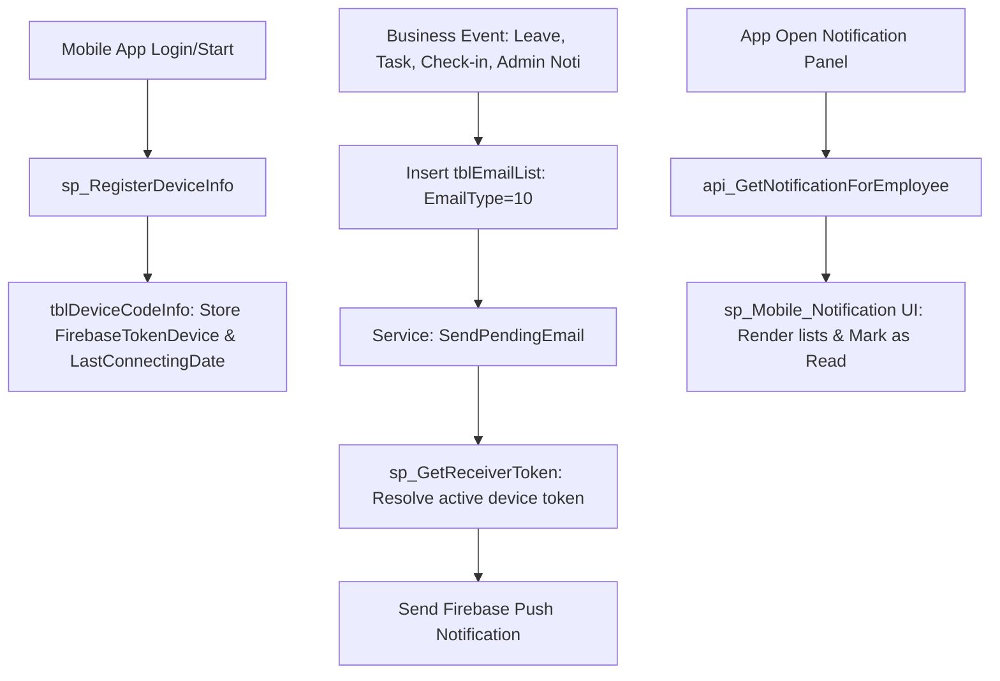

# 16 — Mobile Notification System

Reference: [06_db_login_account.md](06_db_login_account.md) (`tblSC_Login`), [01_architecture.md](01_architecture.md) (Mobile ESS architecture).

ParadiseHR routes mobile notifications via Firebase Cloud Messaging (FCM). The system schedules push events through a unified DB email/push queue.



---

## 1. Device Registration & Tokens: `tblDeviceCodeInfo`
Stores device tokens and associations. Web portals and mobile apps register via `sp_RegisterDeviceInfo` on startup.
*   **Key Columns**: `Identifier` (Device ID PK), `FirebaseTokenDevice` (FCM push token), `EmployeeID`, `LoginID`, `platform` (Android, iOS, Web), `LastConnectingDate` (used to locate the newest active device token).
*   *Registration Proc (`sp_RegisterDeviceInfo`)*: Upserts device data based on `@Identifier`. If `@LoginID = -2`, the registered device record is purged.

---

## 2. Notification Queue: `tblEmailList` (EmailType = 10)
App push notifications are queued as records inside `tblEmailList`.
*   **Key Columns**:
    - `EmailType`: Set to `10` for push notifications.
    - `SendToEmail`: Stores the target `FirebaseTokenDevice` FCM token (approx. 142 chars).
    - `SendToEmployeeID` / `EmployeeID`: Target employee IDs.
    - `TemplateName`: Logic trigger (e.g. `sp_Task_NotiApproval`, `DailyAttendance_Notify`, `NotificationTemplate`).
    - `SendSubjectEmail` / `SendBodyEmail`: Notification payload text.
    - `notificationID`: References `tblNotificationLocal`.
*   **Processing Service**: Background daemon class `HPA.Service.Common.EmailProcessing` (linked to `TaskSchedule.FunctionName = 'SendPendingEmail'`) processes pending rows (`SendStatus = 0`, `Approved_Send = 1`), retrieves the token, and transmits the FCM push.

---

## 3. Resolving Target Tokens
Procedures lookup the newest token by checking `LastConnectingDate`:
*   `sp_GetReceiverToken` (`@EmailID`): Resolves the `FirebaseTokenDevice` FCM token for the target employee ID linked to the email record.
*   `sp_GetReceiverToken_byEmployeeID` (`@EmployeeID`): Directly returns the active FCM token of the employee's newest connected device.

---

## 4. Admin/Local Notifications Flow
1.  **Header Creation**: Insert info to `tblNotificationLocal` (`title`, `content` HTML, `contentNoHtml`, `notificationStatusID = 3` [Draft], `notificationFromDate`).
2.  **Recipients List**: Insert items to `NotificationRecipient` (`notificationID`, `recipientID` Employee ID).
3.  **Compilation** (`sp_ProcessNotificationLocal`): Selects pending records (`notificationStatusID = 2` [Ready] and `notificationFromDate <= GETDATE()`), maps active logins, and copies records to `tblEmailList`:
    ```sql
    INSERT INTO tblEmailList (TemplateName, SendStatus, EmployeeID, Approved_Send, EmailType, notificationID)
    SELECT 'NotificationTemplate', 0, b.recipientID, 1, 10, a.NotificationID
    FROM @NotiIDs a INNER JOIN NotificationRecipient b ON a.notificationID = b.notificationID;
    ```
4.  Updates status of original notification to `1` (Completed) and sets `SendPendingEmail` schedule to execute immediately.

---

## 5. In-App Notification Center Feed
The mobile app retrieves the user's notification timeline using the following interfaces:
*   **UI Wrapper**: `sp_Mobile_Notification` renders the HTML/CSS/JS container page and registers action hooks: mark as read (`api_UpdateAsReadNotificationForEmployee`), read all (`api_UpdateAsReadNotificationForEmployeeAll`), and delete (`api_DelNotificationForEmployee`).
*   **API Data Feed**: `api_GetNotificationForEmployee` (`@LoginID`, `@LanguageID`) fetches the latest 200 items from `tblEmailList` (where `NotifycationStatusID` is `0` or `1`), joins `tblNotificationType` to fetch category templates, and outputs the payload variables `OpenForm` and `ExtraData`.

---

## 6. Debug & Diagnostics Queries
```sql
-- 1. Check registered device tokens for an employee
SELECT Identifier, platform, LEN(FirebaseTokenDevice) AS TokenLen, LastConnectingDate, DeviceName
FROM dbo.tblDeviceCodeInfo WHERE EmployeeID = '<EmployeeID>' ORDER BY LastConnectingDate DESC;

-- 2. Check pending notification queue
SELECT EmailID, TemplateName, SendStatus, Approved_Send, SendToEmployeeID, LEN(SendToEmail) AS TokenLen, SendSubjectEmail
FROM dbo.tblEmailList WHERE EmailType = 10 AND SendStatus = 0 ORDER BY EmailID DESC;

-- 3. Run dry-run fetch of feed items
EXEC dbo.api_GetNotificationForEmployee @LoginID = <LoginID>, @LanguageID = 'VN', @ParadiseVersion = '';
```
