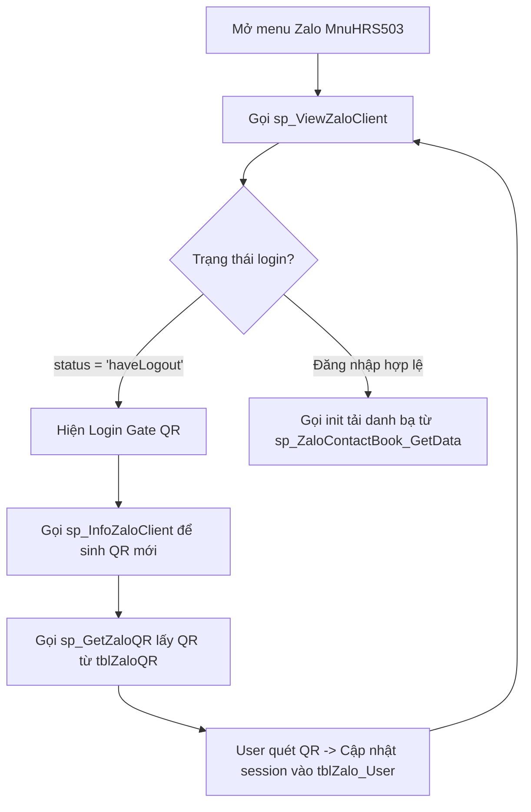

# 28 — Tích hợp Zalo cá nhân / Zalo Client API

> Hướng dẫn tích hợp Zalo cá nhân, lưu session đăng nhập QR, đồng bộ bạn bè/nhóm, danh bạ và gọi API qua SQL Server.
> ⚠️ **Zalo Official Account (OA)** đã lỗi thời và không còn sử dụng (Xem [99_deprecated.md](99_deprecated.md)).

---

## 1. Cấu trúc bảng cơ sở dữ liệu

| Tên bảng | Vai trò | Các cột quan trọng |
|---|---|---|
| `tblZalo_User` | Lưu session đăng nhập Zalo theo tài khoản hệ thống | `LoginID`, `UserInfo` (JSON avatar/display_name), `LoginInfo` (JSON Cookie/SecretKey), `level` (1 = active), `uid`, `WebSocketStatus` |
| `tblZaloQR` | Lưu mã QR login Zalo mới nhất | `QRCode`, `CreateTime` |
| `tblZaloClientFriends` | Danh sách bạn bè Zalo cá nhân | `LoginID`, `userId`, `displayName`, `avatar`, `phoneNumber` |
| `tblZaloClientGroups` | Danh sách nhóm chat Zalo | `LoginID`, `groupId`, `groupName`, `avatar`, `memVerList` |
| `tblZaloClientGroupsMember` | Thành viên nhóm chat Zalo | `LoginID`, `groupId`, `userId`, `displayName`, `avatar` |
| `tblZaloMessage` | Nhật ký lịch sử gửi/nhận tin | `LoginID`, `fromID`, `toID`, `message` (plaintext), `imgURL`, `msgType`, `timeSend` |
| `tblZaloClientFunction` | Danh mục API endpoints cấu hình | `FunctionName` (sendMessage, sendPhoto...), `FunctionUrl`, `Method`, `Parameter` |

---

## 2. Gửi tin nhắn qua `sp_CallAPIZalo`

Tự động gọi HTTP API Zalo Client thông qua thủ tục `ss_RequestHttp_Zalo` và OLE Automation.

### 2.1. Cú pháp gửi tin nhắn Text
* **Gửi cho cá nhân (Friend)**:
  ```sql
  EXEC dbo.sp_CallAPIZalo 
      @CallFunction = 'sendMessage',
      @LoginID = 62, @UserIdSend = 'ZaloUserID_XYZ', @MessageSend = N'Nội dung tin nhắn gửi bạn';
  ```
* **Gửi vào nhóm (Group)**:
  ```sql
  EXEC dbo.sp_CallAPIZalo 
      @CallFunction = 'sendGroupMessage',
      @LoginID = 62, @UserIdSend = 'ZaloGroupID_123', @MessageSend = N'Tin nhắn gửi nhóm';
  ```

### 2.2. Cú pháp gửi tin nhắn hình ảnh (Photo)
Đường dẫn ảnh trên server truyền qua `@MessageSendPath` dưới dạng chuỗi JSON:
```sql
EXEC dbo.sp_CallAPIZalo 
    @CallFunction = 'sendPhoto', -- 'sendGroupPhoto' nếu gửi nhóm
    @LoginID = 62, @UserIdSend = 'ZaloUserID_XYZ',
    @MessageSend = N'Mô tả ảnh (caption)',
    @MessageSendPath = N'{"path":"C:\\temp\\image.jpg","width":800,"height":600}';
```
* **Quy trình gửi ảnh ngầm**: 
  1. Gọi API nội bộ đọc ảnh trên Server $\rightarrow$ Base64.
  2. Dùng OLE `ADODB.Stream` convert Base64 sang binary (`varbinary(max)`).
  3. POST multipart data lên photo CDN bằng `MSXML2.ServerXMLHTTP.6.0`.
  4. Nhận response chứa photo ID và gọi API `sendPhoto` chính thức.

---

## 3. Luồng đăng nhập QR Code (Zalo Login Gate)

Hệ thống bắt buộc kiểm tra trạng thái login trước khi thao tác danh bạ:



---

## 4. Các lỗi thường gặp (Troubleshooting)

| Triệu chứng | Nguyên nhân | Hướng xử lý |
|---|---|---|
| Lỗi gửi tin `status = 'haveLogout'` | Cookie đăng nhập đã hết hạn hoặc bị hủy trên điện thoại | Quét lại mã QR trên màn hình quản lý để làm mới session. |
| Lỗi gửi ảnh `ADODB Write FAILED` | SQL Server chưa được bật quyền gọi OLE COM objects | Bật cấu hình OLE: `sp_configure 'Ole Automation Procedures', 1; RECONFIGURE;` |
| Ảnh gửi thành công nhưng không hiển thị trên client | Kích thước ảnh truyền vào JSON `@MessageSendPath` sai hoặc rỗng | Đảm bảo điền đúng thuộc tính `"width"` và `"height"` thực tế của ảnh. |

---

## 5. Danh bạ Zalo (`MnuHRS503`) & Quản lý tin nhắn (`MnuMKT069`)

* **Giao diện**: Danh bạ Zalo dùng UI 2 cột (sidebar Bạn bè/Nhóm và màn hình chat) theo chuẩn Paradise Style.
* **Wrapper đọc cache**: `sp_ZaloContactBook` và `sp_ZaloChatManagement`.
* **API cung cấp dữ liệu**: `sp_ZaloContactBook_GetData` và `sp_ZaloChatManagement_GetData`.
  * `@Action = 'GET_ZALO_USERS'`: Trả danh sách account Zalo active (lấy thêm cột `avatar` từ JSON `UserInfo` để render header).
  * `@Action = 'GET_FRIENDS'` / `'GET_GROUPS'`: Trả danh bạ.
  * `@Action = 'SEND_MESSAGE'`: Gửi tin (Ghi nhận kết quả qua bảng tạm và chỉ ghi nhật ký `tblZaloMessage` khi gửi thành công).
* **Reset cache sau khi sửa renderer**:
  ```sql
  DELETE FROM dbo.tblHtmlScriptCache WHERE TableName IN ('sp_ZaloContactBook', 'sp_ZaloContactBook_html', 'sp_ZaloChatManagement', 'sp_ZaloChatManagement_html');
  EXEC dbo.sp_GenerateHTMLScript 'sp_ZaloContactBook_html';
  EXEC dbo.sp_GenerateHTMLScript 'sp_ZaloChatManagement_html';
  ```
