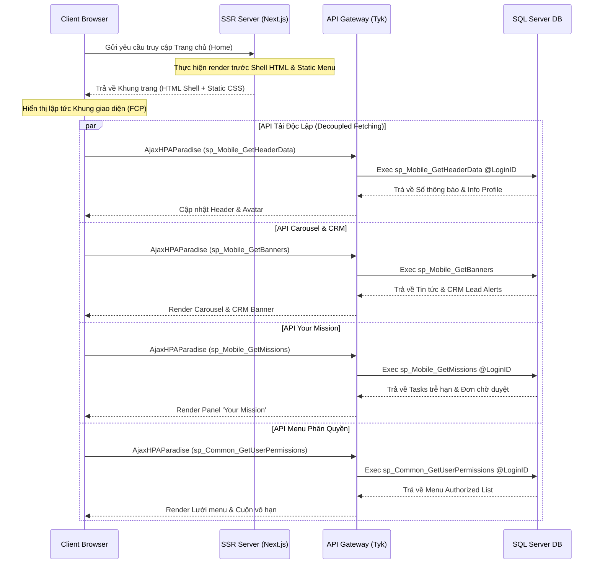

# 30 — Kế hoạch Thiết kế & Triển khai Giao diện Mobile cho ParadiseHR

Tài liệu này mô tả chi tiết kế hoạch thiết kế và triển khai giao diện di động (Mobile Web App) cho hệ thống ParadiseHR theo định hướng **Mobile-First**, **App-like UX**, kết hợp công nghệ kết xuất tối ưu **Server-Side Rendering (SSR)** và tải dữ liệu không đồng bộ **Decoupled Component Fetching**.

---

## 1. Tư duy Thiết kế & Trải nghiệm Người dùng (Mobile-First & App-like)

Giao diện được thiết kế để mang lại cảm giác mượt mà và trực quan như một ứng dụng Native (iOS/Android):
*   **Viewport & Touch-first:** Tối ưu hóa kích thước nút bấm (tối thiểu $44 \times 44 \text{ px}$), khoảng cách đệm (padding/margin) theo hệ thống Grid di động.
*   **Gestures:** Hỗ trợ vuốt chạm (swipe) để chuyển đổi banner, carousel và đóng mở ngăn kéo menu (drawer).
*   **Fixed Layout:** Tránh hiện tượng giật trang (layout shift). Thanh điều hướng dưới luôn cố định (`position: fixed; bottom: 0; z-index: 1000`).

---

## 2. Chi tiết Thiết kế Các Thành phần Giao diện (UI Components)

### 2.1. Header (Thanh đầu trang)
*   **Thành phần chính**:
    *   **Thanh tìm kiếm thông minh (Smart Search Bar):** Dạng input rút gọn, hỗ trợ tìm nhanh nhân viên (gọi `fn_vtblEmployeeList_Bydate`), chức năng menu hoặc đơn từ (gọi từ bảng Men_Menu nhưng được lọc những menu phân quyền và chỉ triển khai trên web giao diện mới).
    *   **Nút chuông thông báo (Notifications):** Chia làm 2 tab:
        *   *Thông báo chung:* Tin tức công ty, sự kiện (truy xuất từ `tblNotificationLocal`).
        *   *Thông báo phê duyệt:* Các yêu cầu phê duyệt đơn từ, OT, công việc (`tblTask_Approvals`, `tblAttendanceConfirmRequest`).
    *   **Lối tắt Trang cá nhân (Profile Shortcut):** Hiển thị ảnh đại diện nhân viên (avatar) được tải bất đồng bộ và lưu cache bộ nhớ qua hàm `loadEmployeeAvatarAsync` từ procedure `fn_GetStringParamImageByEmployeeID`.

### 2.2. Dynamic Banners & Carousel (Bảng hiệu & Quảng cáo động)
*   **Thành phần chính**:
    *   **Tin tức & Thông báo nội bộ:** Các thông báo khẩn từ Ban Giám đốc gửi đến người lao động.
    *   **Cảnh báo CRM Nóng (CRM Lead Alerts):** Hiển thị banner đặc biệt nhấp nháy/chạy chữ khi có Lead mới được phân bổ cho Sales trong CRM (quét bảng `tblCRM_CompanyInfo` và `tblCRM_CustomerPersonInfo`).
    *   **Công nghệ:** Vuốt chạm cảm ứng mượt mà, tự động chuyển trang sau 5 giây.

### 2.3. Lưới danh mục chính (Categories Grid)
*   **Thành phần chính**: Lưới $2 \times 4$ hoặc $3 \times 3$ các icon đại diện cho các phân hệ (Module) lớn của ParadiseHR:
    *   `Nhân sự (HRS)`: Tra cứu thông tin cá nhân, hồ sơ gia đình (`tblFamilyInfo`).
    *   `Chấm công (TAD)`: Chấm công GPS/Wifi, xem bảng công (`tblHasTA`).
    *   `Lương & Phúc lợi (PRL)`: Tra cứu phiếu lương (Payslip) từ `SALCAL_MAIN`.
    *   `Tuyển dụng (REC)`: Theo dõi chiến dịch và hồ sơ ứng viên.
    *   `Đào tạo (TM)`: Bài học trực tuyến, xem xếp hạng XP/Coin (`tblRank_PointType`).
    *   `Giao việc (AT)`: Quản lý task, checklist dự án (`tblTask_Tasks`).
    *   `CRM`: Đường ống bán hàng (Sales Pipeline), quản lý khách hàng.

### 2.4. Khu vực Các công việc của bạn (Your Mission)
*   Hiển thị danh sách nhiệm vụ được cá nhân hóa sâu theo từng nhân viên:
    *   **Nhiệm vụ sắp hết hạn (Overdue/Upcoming Tasks):** Các task trong `tblTask_Tasks` có `DueDate` gần kề và `StatusID IN (1, 2)`.
    *   **Bài học chưa hoàn thành:** Bài học khóa đào tạo bắt buộc chưa tích lũy đủ XP.
    *   **Đơn từ chờ duyệt:** Đơn xin nghỉ phép, xác nhận công, hoặc phê duyệt tăng ca của cấp dưới gửi lên.

### 2.5. Khu vực Menu được phân quyền (Authorized Menu)
*   **Cơ chế Infinite Scroll (Cuộn vô hạn):** Danh sách các menu cụ thể mà người dùng được phép truy cập theo phân quyền RBAC (quét từ `tblSC_Right_Stored` và `tblSC_GroupRight` thông qua stored procedure `sp_Common_GetUserPermissions`).
*   **Cá nhân hóa theo hành vi:** Menu được sắp xếp động, đưa các chức năng có tần suất truy cập cao nhất của người dùng đó lên đầu.

### 2.6. Bottom Navigation Bar (Thanh điều hướng dưới)
*   Cố định ở đáy màn hình, chứa 5 nút chức năng chính:
    1.  `Trang chủ (Home)`: Về màn hình dashboard chính.
    2.  `Gần đây (Recent)`: Danh sách các menu vừa thao tác gần nhất (lưu trong LocalStorage).
    3.  `Đơn từ (Requests)`: Lối tắt tạo nhanh đơn xin nghỉ phép, tăng ca, công tác.
    4.  `Hỗ trợ (Support)`: Gửi ticket hỗ trợ kỹ thuật hoặc chat nội bộ.
    5.  `Thêm/Tôi (Profile/More)`: Cài đặt tài khoản, 2FA, ngôn ngữ và đăng xuất.

---

## 3. Cách thức Load Dữ liệu API (Data Loading Strategy)

Để tối ưu hóa tốc độ tải trang trên kết nối di động 3G/4G/5G và đảm bảo tính chịu tải cao, ParadiseHR Mobile áp dụng chiến lược kết hợp SSR và Decoupled Fetching:



### 3.1. Tải trang ban đầu (SSR - Server-Side Rendering)
*   **Mục tiêu**: Tối ưu hóa chỉ số LCP (Largest Contentful Paint) và SEO.
*   **Hoạt động**: Next.js Server thực hiện sinh trước (pre-render) khung xương giao diện (HTML Skeleton), định dạng CSS cốt lõi (ParadiseStyle tokens) và các thành phần tĩnh không thay đổi theo phiên (như cấu trúc Grid, logo, biểu tượng menu mặc định).

### 3.2. Tải dữ liệu độc lập (Decoupled Component Fetching)
*   **Mục tiêu**: Giảm thiểu nghẽn luồng dữ liệu (bottleneck) và tăng tính cô lập lỗi (fault tolerance).
*   **Hoạt động**:
    *   Ngay khi Client nhận được HTML Shell và quá trình hydration của React hoàn tất, các component trên màn hình sẽ gọi API không đồng bộ thông qua hàm trợ giúp `AjaxHPAParadise`.
    *   Mỗi API gọi tới một Procedure độc lập trên Database SQL Server.

#### Ví dụ mã nguồn Client gọi API bất đồng bộ cho khu vực "Your Mission":
```javascript
// Hàm tải dữ liệu nhiệm vụ cá nhân hóa cho User
function loadUserMissions() {
    const loginId = window.UserID || window.LoginID;
    if (!loginId) return;

    // Hiển thị loading spinner cho riêng thẻ nhiệm vụ
    $("#missionContainer").addClass("paradise-loading");

    AjaxHPAParadise({
        data: {
            name: "sp_Mobile_GetMyMission", // Procedure chuyên biệt
            param: [
                "LoginID", loginId,
                "LanguageID", window.LanguageID || "VN",
                "Limit", 5
            ]
        },
        success: function (res) {
            $("#missionContainer").removeClass("paradise-loading");
            try {
                if (typeof res === "string") {
                    res = res.includes("{") ? res : EncryptionStringDecryption(res);
                }
                const json = typeof res === "string" ? JSON.parse(res) : res;
                
                const taskOverdue = json?.data?.[0] || [];   // Select 1: Tasks sắp trễ hạn
                const pendingApprovals = json?.data?.[1] || []; // Select 2: Đơn từ chờ duyệt
                const incompleteLessons = json?.data?.[2] || []; // Select 3: Bài học chưa hoàn thành
                
                renderMissionsUI(taskOverdue, pendingApprovals, incompleteLessons);
            } catch (err) {
                console.error("Lỗi parse dữ liệu Mission:", err);
            }
        },
        error: function (err) {
            $("#missionContainer").removeClass("paradise-loading");
            // Chỉ hiển thị cảnh báo cục bộ trên Card, không block toàn màn hình
            $("#missionContainer").html(`
                <div class="paradise-alert paradise-alert--danger">
                    <i class="bi bi-exclamation-triangle"></i> Không thể tải danh sách nhiệm vụ.
                </div>
            `);
        }
    });
}
```

---

## 4. Kế hoạch Triển khai Dữ liệu Backend (Database Mappings)

Để hỗ trợ giao diện mobile hoạt động ổn định, cần triển khai/sử dụng các bảng và stored procedure sau:

### 4.1. Danh sách Bảng Dữ liệu Tương tác chính

| Component | Bảng Database Liên quan | Vai trò trong Mobile |
|---|---|---|
| **Header** | `tblSC_Login`, `tblNotificationLocal` | Xác thực tài khoản, đếm số lượng thông báo chưa đọc. |
| **Carousel** | `tblNotificationLocal`, `tblCRM_CustomerPersonInfo` | Lấy tin tức nội bộ và thông báo CRM mới. |
| **Mission** | `tblTask_Tasks`, `tblTask_Approvals`, `tblAttendanceConfirmRequest` | Truy xuất công việc trễ hạn, danh sách đơn từ chờ phê duyệt. |
| **Authorized Menu** | `MEN_Menu`, `tblSC_Right_Stored`, `tblSC_GroupRight` | Kiểm tra quyền truy cập và cá nhân hóa thứ tự hiển thị menu. |

### 4.2. Stored Procedure mới cần xây dựng (Mobile Wrappers)

1.  `sp_Mobile_GetHeaderData`: Trả về thông tin tóm tắt cho Header gồm: số lượng thông báo chưa đọc, số lượng đơn chờ duyệt, và đường dẫn ảnh đại diện nhân viên (avatar).
2.  `sp_Mobile_GetBanners`: Trả về danh sách banner đang active bao gồm thông báo khẩn của công ty và thông tin lead CRM mới nhận.
3.  `sp_Mobile_GetMyMission`: Xử lý 3 truy vấn con (`SELECT`):
    *   *Select 1*: Top 5 task của LoginID có trạng thái Chưa xong và sát ngày DueDate (`tblTask_Tasks`).
    *   *Select 2*: Danh sách 5 yêu cầu phê duyệt đơn từ/công việc đang chờ LoginID duyệt (`tblTask_Approvals`).
    *   *Select 3*: Các bài học đào tạo bắt buộc chưa hoàn tất.
4.  `sp_Mobile_GetPersonalizedMenus`: Trả về danh sách menu được phân quyền, sắp xếp theo lịch sử sử dụng gần đây của LoginID.

---

## 5. Quy tắc Áp dụng CSS & UI Style (ParadiseStyle)

*   **Không sử dụng CSS nền cứng**: Tuyệt đối không khai báo màu nền tĩnh như `background: #fff` trên body/wrapper. Sử dụng class `.paradise-card` và biến `var(--paradise-bg-surface)` để giao diện tự thích ứng khi người dùng bật chế độ tối (Dark Mode).
*   **Icon đồng bộ**: Chỉ sử dụng thư viện **Bootstrap Icons (BI)** cho các nút bấm và danh mục (ví dụ: `bi bi-search` cho thanh tìm kiếm, `bi bi-bell` cho thông báo, `bi bi-person` cho trang cá nhân, `bi bi-house-door` cho trang chủ).
*   **Loading State**: Khi các component đang thực hiện fetch dữ liệu qua API, bắt buộc hiển thị bộ xương giả lập (Skeleton Loading) hoặc icon xoay tròn `bi bi-arrow-repeat` kết hợp class `.paradise-spin`.
