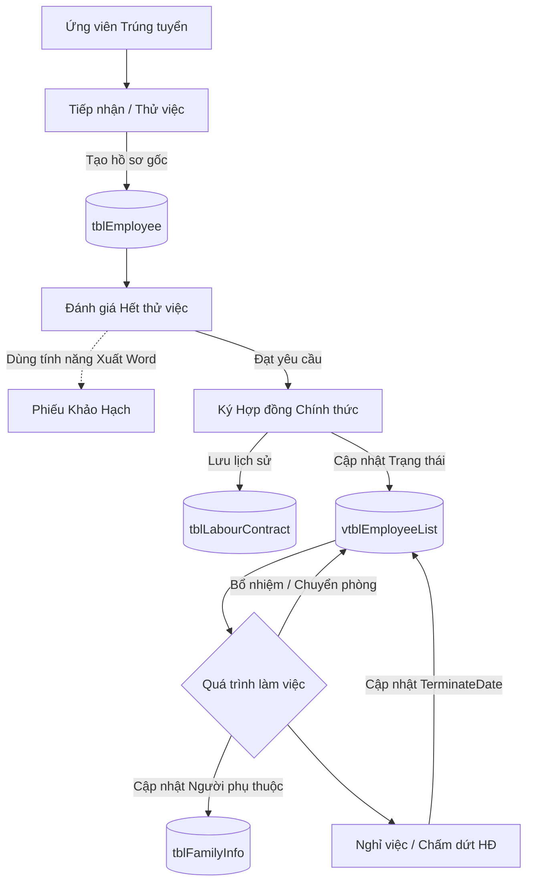

# BỨC TRANH TỔNG THỂ KIẾN TRÚC: PHÂN HỆ NHÂN SỰ (CORE HR)

> **Tài liệu Dành cho Lập trình viên / Chuyên viên triển khai**
> Bản tóm tắt chuyên sâu về phân hệ Nhân sự - "Trái tim dữ liệu" của toàn bộ hệ thống Paradise HR.

---

## 1. Bản chất của Module Nhân Sự
Core HR là nền tảng của mọi hệ thống ERP Nhân sự. Nó quản lý vòng đời của một con người từ khi bước chân vào công ty (Onboarding) cho đến khi rời đi (Offboarding). 
**Lưu ý quan trọng:** Nếu dữ liệu Nhân sự sai (ví dụ: sai mức lương cơ bản, quên kích hoạt nhân viên), thì toàn bộ dữ liệu Chấm công và Tính lương phía sau sẽ sai hoàn toàn.

---

## 2. Sơ đồ Vòng đời Nhân viên (Employee Lifecycle)

Dưới đây là cách dữ liệu luân chuyển qua các bảng khi một nhân sự làm việc tại công ty:

---

## 3. Các Bảng Dữ Liệu Cốt Lõi (Database Schema)

Để làm chủ phân hệ Nhân sự, bạn cần nằm lòng cấu trúc của các bảng sau:

| Tên Bảng | Giải thích chức năng & Cột quan trọng |
| :--- | :--- |
| **`tblEmployee`** | **Hồ sơ gốc tĩnh.** Chứa thông tin bất biến của con người (Mã NV, Họ Tên, CMND/CCCD, Ngày sinh, Giới tính, Quê quán). |
| **`vtblEmployeeList`** | **Hồ sơ động (View Trạng thái hiện tại).** Đây là View được SELECT nhiều nhất. Chứa chức vụ (`PositionID`), Phòng ban (`DepartmentID`). Đặc biệt quan trọng là cột `TerminateDate` (Ngày nghỉ việc) dùng để lọc ra những nhân viên ĐANG làm việc. |
| **`tblDepartment`** | **Cơ cấu tổ chức.** Quản lý sơ đồ phòng ban, chi nhánh, công ty con. |
| **`tblLabourContract`** | **Lịch sử Hợp đồng.** Quản lý quá trình ký HĐLĐ (Thử việc -> Xác định thời hạn 1 năm -> Vô thời hạn). Nó quyết định nhân viên có được đóng BHXH hay không. |
| **`tblFamilyInfo`** | **Người phụ thuộc.** Thông tin vợ/chồng/con cái. Dùng để đối chiếu và tính *Giảm trừ gia cảnh* khi tính Thuế TNCN cuối tháng. |

---

## 4. Những Lỗi Thường Gặp Của Lập Trình Viên Mới

1. **Quên lọc `TerminateDate`:** Khi viết câu query lấy danh sách nhân viên, luôn nhớ phải kiểm tra `WHERE TerminateDate IS NULL` (hoặc lớn hơn ngày đang xét), nếu không bạn sẽ lấy cả những người đã nghỉ việc từ 10 năm trước.
2. **Nhầm lẫn giữa `tblEmployee` và `vtblEmployeeList`:** Nếu muốn đổi tên nhân viên, sửa ở `tblEmployee`. Nếu muốn xem nhân viên đang ở phòng ban nào, dùng `vtblEmployeeList` (lưu ý đây là View, khi muốn điều chuyển thực sự sẽ insert/update ở các bảng lịch sử điều chuyển, hợp đồng tương ứng).
3. **Mã Nhân Viên (EmployeeID):** Luôn là Khóa chính (Primary Key) kết nối toàn bộ hệ thống. Không bao giờ được phép thay đổi Mã NV sau khi đã phát sinh dữ liệu chấm công/lương.
