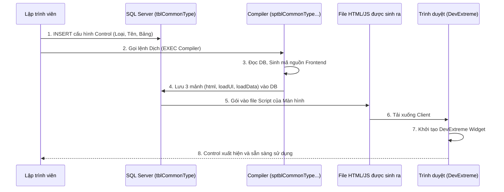
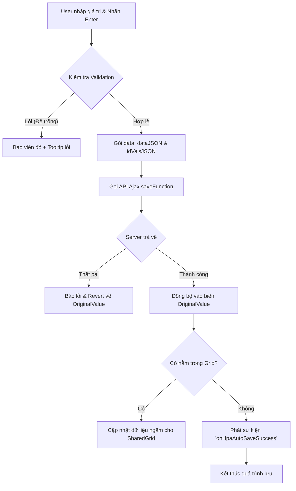

# BỨC TRANH TỔNG THỂ VỀ HỆ THỐNG HPA CONTROL (MASTER OVERVIEW)

> **Tài liệu Dành cho Lập trình viên (Developer Masterclass)**
> Cung cấp kiến thức từ bản chất kiến trúc, luồng hoạt động dưới nền tảng, đến các API nội bộ giúp lập trình viên làm chủ hoàn toàn hệ thống Paradise HR.

---

## 1. Bản chất Metadata-Driven UI
Hệ thống HPA Paradise không lập trình giao diện Frontend (HTML/JS) một cách thủ công (hard-code) cho từng màn hình. Thay vào đó, nó sử dụng kiến trúc **Metadata-Driven UI** (Giao diện điều khiển bằng Dữ liệu).

**Vì sao lại dùng SQL để cấu hình UI?**
- **Phát triển siêu tốc:** Chỉ cần viết 1 câu lệnh `INSERT` vào SQL, hệ thống tự động sinh ra toàn bộ ô nhập liệu, validate, tự động lưu, giao diện chuẩn responsive.
- **Tính nhất quán:** Tất cả TextBox, ComboBox trên mọi màn hình đều có chung một hành vi, chung một kiểu dáng thiết kế (dựa trên bộ UI DevExtreme).
- **Kiểm soát tập trung:** Khi hệ thống muốn đổi màu sắc hoặc thêm tính năng mới cho Dropdown, chỉ cần sửa ở hàm Compiler trung tâm, hàng ngàn màn hình lập tức được cập nhật mà không cần sửa từng file.

---

## 2. Sơ đồ Kiến trúc & Luồng Dữ Liệu (Sequence Diagram)

Mọi Control đều bắt đầu từ một dòng trong bảng `tblCommonControlType_Signed` và kết thúc bằng một Widget trên màn hình của User.



---

## 3. Giải phẫu chi tiết 3 mảnh ghép của 1 Control

Khi Compiler biên dịch 1 dòng SQL, nó cắt Control đó ra làm 3 mảnh mã JavaScript/HTML để nhúng vào trang web:

| Mảnh ghép | Chức năng cốt lõi | Chi tiết kỹ thuật |
| :--- | :--- | :--- |
| **1. `html`** | Tạo vị trí đứng trên trang | Sinh ra thẻ chứa: `<div id="UID_Của_Control"></div>` |
| **2. `loadUI`** | Dựng hình và gắn Sự kiện | Chứa lệnh khởi tạo DevExtreme (VD: `$("#UID").dxTextBox({...})`). Khai báo các sự kiện (onBlur, onKeyDown) và gắn hàm gọi API AutoSave. |
| **3. `loadData`** | Bơm dữ liệu vào Control | Lấy giá trị từ biến toàn cục **`obj`** (`obj.TenCot`) và gọi hàm `Instance.setValue()` để hiển thị lên màn hình. |

**Vai trò của biến `obj`:** Khi màn hình mở lên, server trả về một cục dữ liệu JSON chứa thông tin bản ghi (Ví dụ: 1 nhân viên). Cục JSON này được gán vào biến `obj`. Các mảnh `loadData` sẽ đồng loạt chạy và "hút" dữ liệu từ `obj` để đắp lên UI.

---

## 4. Từ điển các loại Control cốt lõi

| Type (Loại Control) | Ứng dụng | Giá trị đầu ra | Trigger Tự Động Lưu |
| :--- | :--- | :--- | :--- |
| **`hpaControlText`** | Input ngắn (Tên, Mã, Ký hiệu) | String | Khi rời trỏ chuột (`onFocusOut`) hoặc nhấn `Enter`. Nhấn `Esc` để hủy. |
| **`hpaControlTextArea`** | Nhập văn bản dài, Ghi chú | String | Khi rời trỏ chuột hoặc nhấn `Ctrl+Enter`. |
| **`hpaControlSelectBox`** | Dropdown chọn 1 (Trạng thái, Phân loại) | String (ID đơn) | Ngay khi giá trị thay đổi (`onValueChanged`). Phải có `DataSourceSP`. |
| **`hpaControlTagBox`** | Dropdown chọn nhiều (Gắn tags, Chọn nhiều phòng ban) | **Array** chứa các ID | Ngay khi tick chọn/bỏ chọn. Hệ thống tự map String "1,2,3" thành Array. |
| **`hpaControlSelectEmployee`**| Popup chọn Nhân viên (Có Avatar) | Array chứa IDs | Khi bấm nút "Xác nhận" trên Popup chọn người. |
| **`hpaControlDate` / `Time`** | Chọn Ngày, Tháng, Giờ | Date Object | Ngay khi chọn ngày trên Lịch (`onValueChanged`). |
| **`hpaControlMoney`** | Nhập Tiền tệ (VND, USD) | Number | Rời trỏ chuột hoặc `Enter`. Tự động format thêm dấu phẩy. |
| **`hpaControlTextSearch`** | Ô tìm kiếm dạng gõ để tìm (Lazy load) | String | Chọn Item từ danh sách rơi xuống. |

---

## 5. Vòng đời Tự Động Lưu (AutoSave Flow)

Cơ chế "Ma thuật" của HPA là khả năng AutoSave. Dưới đây là những gì diễn ra ngầm khi người dùng sửa 1 ô và bấm Enter:


*Định dạng đóng gói:* Hệ thống gửi `dataJSON` (chứa tên cột, giá trị mới) và `idValsJSON` (chứa tên cột Khóa chính và Giá trị khóa chính để Server biết đang update dòng nào).

---

## 6. Tích hợp Lưới (ControlGrid) vs Control Đơn Lẻ

- **Control Đơn Lẻ:** Hiển thị tự do trên màn hình. Giá trị cột `Layout = NULL`.
- **Control Nằm Trong Lưới (Grid):** Để nhét các Control vào thành các Cột của một Bảng, bạn phải tuân thủ khái niệm **"Dòng Grid Cha"**.

**Cơ chế Grid Cha:**
Trước khi INSERT các cột con, bạn bắt buộc phải INSERT 1 dòng đại diện cho cái "Khung lưới". 
Dòng này có đặc điểm: `ColumnName` = chính tên của lưới (Ví dụ: `GridLienHe`), và `GridColumnName` cũng bằng tên đó.
Các dòng con theo sau phải khai báo `Layout = 'Grid_View'` và trỏ `GridColumnName` về tên của Grid Cha. 
Lúc này, thay vì sinh ra các thẻ `div` rời rạc, Compiler sẽ gộp chúng lại thành cấu hình `columns` của `dxDataGrid`.

---

## 7. Biến Toàn Cục (Global Variables) & API Runtime (JavaScript)

Để có thể can thiệp sâu vào các Control bằng JavaScript ở phía Client, hệ thống cung cấp các biến và hàm sau:

### A. Biến Toàn Cục (Sinh tự động)
- `window["DataSource_TenCot"]`: Chứa toàn bộ mảng Dữ liệu (Array of Objects) của cái SelectBox/TagBox đó.
- `window["DataSourceIDField_TenCot"]` / `window["DataSourceNameField_TenCot"]`: Lưu tên cột dùng làm Value (thường là ID) và Text (thường là Name).
- `window.currentClicked_GridColumnName`: Lưu lại Khóa chính của cái dòng mà User vừa bấm chuột vào trong Grid.

### B. Can thiệp Logic bằng Callback
Khi User đổi giá trị, bạn muốn gọi thêm hàm JS của riêng bạn? Đừng can thiệp vào `onValueChanged` của hệ thống, hãy dùng:
```javascript
window["onSelectBoxChanged_TenCot"] = function(value, instance, event) {
    // Viết code xử lý của bạn ở đây sau khi nó lưu xong!
};
```

### C. Gán giá trị bằng Code (Pattern Suppress / Resume)
Nếu bạn dùng `Instance.setValue(val)`, hệ thống sẽ tưởng là User vừa gõ và sẽ tự động bắn API AutoSave (gây lỗi hoặc dư thừa). Để gán ngầm bằng code, BẮT BUỘC dùng pattern sau:
```javascript
Instance_TenCot._suppressValueChangeAction(); // Bịt miệng sự kiện
Instance_TenCot.option("value", giaTriMoi);   // Bơm giá trị vào
Instance_TenCot._resumeValueChangeAction();   // Mở miệng sự kiện lại
```

### D. Các cờ Tùy Biến Giao Diện (Runtime Flags)
Gán các biến này trước khi dòng lệnh `loadUI` chạy để biến đổi hình dạng Control:
- `window["_hideID_TenCot"] = true`: Giấu mã ID trong Dropdown, chỉ hiện tên.
- `window["_hideSearch_TenCot"] = true`: Tắt ô tìm kiếm trong Dropdown.
- `window["_isEdit_TenCot"] = true`: Hiện nút cây bút ✏️ để user có thể sửa ngay tên của Item trong Dropdown.
- `_readOnly_TenCot = true`: Khóa cứng Control, biến nó thành ô chỉ xem.

---

## 8. Template SQL INSERT Chuẩn Nhất

Dưới đây là công thức chuẩn mực để khai báo 1 Control Text bình thường và 1 Control SelectBox (có load danh sách).

```sql
-- 1. CONTROL TEXT (Input thường, bắt buộc nhập, tự động lưu)
INSERT INTO tblCommonControlType_Signed
  (TableName, ColumnIDName, TableEditor, ColumnName, Type, DisplayName, IsRequired, AutoSave)
SELECT 
  'sp_CRM_EditContract_html',  -- Màn hình
  'ContractID',                -- Khóa chính
  'tblCRM_Contract',           -- Bảng vật lý
  'ContractName',              -- Cột dữ liệu
  'hpaControlText',            -- Loại Control Text
  'Tên hợp đồng',              -- Tiêu đề
  1,                           -- Bắt buộc nhập (Có)
  1;                           -- Tự động lưu (Có)


-- 2. CONTROL SELECT BOX (Dropdown chọn 1, có load SP)
INSERT INTO tblCommonControlType_Signed
  (TableName, ColumnIDName, TableEditor, ColumnName, Type, DisplayName, DataSourceSP, AutoSave)
SELECT 
  'sp_CRM_EditContract_html',  
  'ContractID',                
  'tblCRM_Contract',           
  'StatusID',                  
  'hpaControlSelectBox',       -- Loại Dropdown
  'Trạng thái',                
  'sp_GetContractStatusList',  -- [QUAN TRỌNG] Tên SP để phần mềm load danh sách trạng thái
  1;                           
```
