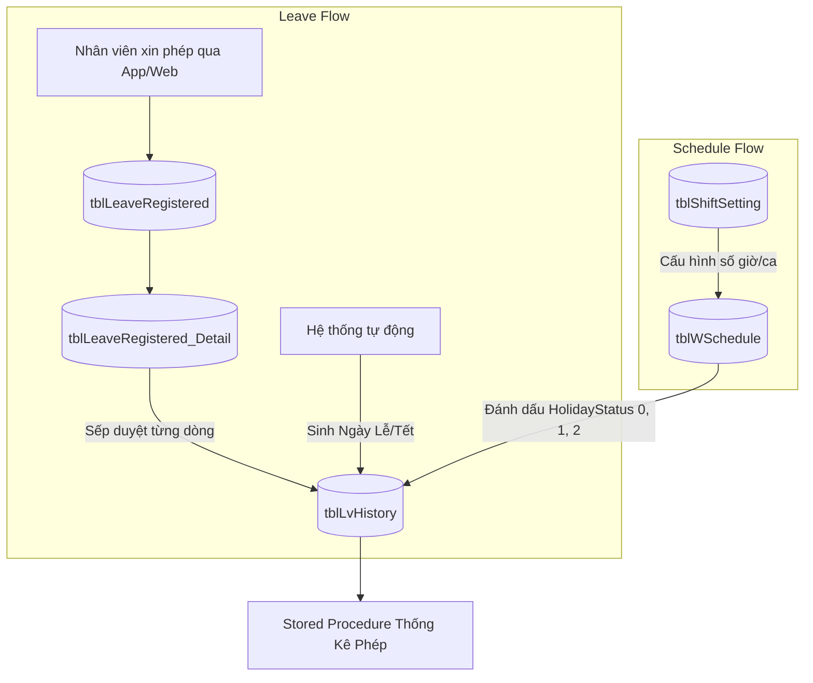

# BỨC TRANH TỔNG THỂ KIẾN TRÚC: NGHIỆP VỤ NGHỈ PHÉP & BÁO CÁO (LEAVE MANAGEMENT)

> **Tài liệu Dành cho Lập trình viên / Chuyên viên triển khai**
> Bản tóm tắt chuyên sâu về phân hệ Quản lý Nghỉ phép (Leave Management) và luồng xử lý báo cáo dữ liệu động trong hệ thống Paradise HR.

---

## 1. Vòng Đời Của Một Ngày Nghỉ (Leave Lifecycle)

Trong hệ thống Paradise HR, quy trình nghỉ phép được tách bạch rõ ràng giữa "Yêu cầu" và "Thực tế" để đảm bảo tính chặt chẽ trong việc tính công và tính lương.

### Các bảng dữ liệu cốt lõi

| Tên Bảng                        | Giải thích chức năng & Ý nghĩa                                                                                                                                                                                                                                               |
| :------------------------------ | :--------------------------------------------------------------------------------------------------------------------------------------------------------------------------------------------------------------------------------------------------------------------------- |
| **`tblLeaveRegistered`**        | **Header đơn nghỉ phép.** Lưu thông tin chung của đơn như `IdentityID`, `EmployeeID`, `LeaveFromDate`, `LeaveToDate`, `LeaveCode`, `Approve_Status`, `Current_Approve_Level`, `Approver_1..4`, `Reason`, `CreateTime`, `isSubmit`, `isApprove`, `ApproveTime`, `RejectTime`. |
| **`tblLeaveRegistered_Detail`** | **Chi tiết dòng nghỉ phép theo ngày/giờ.** Lưu `LeaveDate`, `LeaveFrom`, `LeaveTo`, `LeaveCode`, `LvAmount`, `Approve_Status`, `reason`, `ALLeaveHours`, `RejectedBy`. Mỗi đơn có thể có nhiều dòng detail, và phần dòng này mới quyết định số công/phép cụ thể.             |
| **`tblLvHistory`**              | **Bảng Lịch Sử Thực Tế (Source of Truth).** Đây là nơi "chốt hạ" dữ liệu nghỉ phép cuối cùng để dùng cho tính công và tính lương. Cột quan trọng gồm `EmployeeID`, `LeaveDate`, `LeaveStatus`, `LeaveCode`, `LvAmount`, `LvRegister`, `LeaveFrom`, `LeaveTo`, `StatusID`.    |
| **`tblLeaveType`**              | **Danh Mục Loại Phép.** Định nghĩa các loại phép của công ty (Phép năm, Nghỉ ốm, Thai sản...). Chứa cấu hình hiển thị (`IsVisible`), tỷ lệ trả lương (`PaidRate`), loại yêu cầu (`RequestType`) và các cờ báo cáo.                                                           |

---

## 2. Quản Lý Ca Làm Việc & Phân Loại Ngày (Schedule & Shifts)

Để tính chính xác 1 ngày nghỉ phép tương ứng với bao nhiêu công, hệ thống cần biết nhân viên đó được xếp lịch làm việc như thế nào trong ngày hôm đó.

### Các bảng cấu hình ca làm việc

| Tên Bảng              | Giải thích chức năng & Ý nghĩa                                                                                                                                                                                 |
| :-------------------- | :------------------------------------------------------------------------------------------------------------------------------------------------------------------------------------------------------------- |
| **`tblShiftSetting`** | **Định Nghĩa Ca Làm Việc.** Nơi lưu các cấu hình ca (Ví dụ: Ca Hành chính 8 tiếng, Ca đêm 12 tiếng). Chứa trường quan trọng `Std_Hour_PerDays` (Số giờ chuẩn của ca) dùng để quy đổi giờ nghỉ thành ngày nghỉ. |
| **`tblWSchedule`**    | **Lịch Làm Việc Chi Tiết.** Bảng mapping xếp ca cho từng nhân viên theo từng ngày cụ thể (Employee A làm Ca HC vào ngày 01/05).                                                                                |

**Ý nghĩa cột `HolidayStatus` (Trạng thái ngày) trong `tblWSchedule`:**
Cờ (Flag) đánh dấu tính chất của ngày hôm đó để máy tính OT (Tăng ca) hoặc trừ phép:

- `0`: **Ngày thường** (Đi làm tính công x1, tăng ca x1.5).
- `1`: **Ngày Chủ Nhật / Nghỉ tuần** (Đi làm tính tăng ca x2).
- `2`: **Ngày Lễ** (Đi làm tính tăng ca x3).

---

## 3. Sơ Đồ Mối Liên Hệ (ERD)

---

## 4. Luồng Chạy Code Mới: Báo Cáo Thống Kê Phép (Dynamic Report)

Thủ tục `sp_Export_ThongKePhep_Thang5` đã được chuẩn hóa để xử lý báo cáo động, khớp hoàn hảo với File Excel Template trống. Luồng chạy bao gồm 6 bước "vàng":

### Bước 1: Chốt Thời Gian (Salary Period)

- Hệ thống không tính từ mùng 1 đến cuối tháng, mà dùng hàm `fn_Get_SalaryPeriod` để lấy chính xác khoảng ngày của **Kỳ lương** (Ví dụ: 26/04 đến 25/05).

### Bước 2: Chuẩn Bị "Bộ Khung Cột" (Dynamic Columns)

- Quét bảng `tblLeaveType` để lấy ra **TOÀN BỘ** các loại phép đang được sử dụng (IsVisible = 1, loại trừ 'DB', 'HH').
- Ép SQL Server tạo sẵn một ma trận cột (Đám tang, Ốm, Thai sản...). Kỹ thuật này đảm bảo File Excel **không bao giờ bị thiếu cột** dù tháng đó không có ai xài loại phép đó.

### Bước 3: Gom Danh Sách Nhân Sự (Employee List)

- Dùng hàm `fn_vtblEmployeeList_Bydate` để lấy toàn bộ nhân viên **có trạng thái làm việc trong kỳ đó**.
- Lọc thông minh: Giữ lại cả những người đã nghỉ việc giữa kỳ (để trả lương tháng cuối), và xoá những người vào làm sau khi kỳ lương kết thúc. Nối thêm bảng `tblDepartment` để lấy tên Bộ phận.

### Bước 4: TÍNH TOÁN DỮ LIỆU (Core Logic)

- Kết hợp lịch sử nghỉ (`tblLvHistory`) + Lịch làm việc (`tblWSchedule`) + Định nghĩa ca (`tblShiftSetting`).
- **Công thức tính ngày nghỉ chuẩn xác:** `Giờ nghỉ (LvAmount) / Thời gian chuẩn của ca hôm đó (Std_Hour_PerDays)`.
- _Ví dụ:_ Xin nghỉ 4 tiếng vào ngày làm ca 8 tiếng => SQL tính ra 0.5 ngày phép. (Nếu hardcode chia cho 8 sẽ sai đối với các ca 12 tiếng).

### Bước 5: Lắp Ghép & Xoay Ngang (Dynamic PIVOT)

- Dùng kỹ thuật LEFT JOIN để xuất ra toàn bộ nhân sự (kể cả người có 0 ngày nghỉ).
- Dùng `PIVOT` để xoay dọc thành ngang, rải số liệu vào đúng cột Loại phép của từng người, tự động tính tổng (`Tổng cộng`).

### Bước 6: Trả Cờ Cấu Hình Xuất Excel (Export Config)

- Trả về bảng ảo `#ExportConfig` với tham số `ParseType = 'Table'`, `WithHeader = 1`.
- Bước này "ra lệnh" cho phần mềm C# (Paradise HR) tự động vẽ tiêu đề cột và đắp dữ liệu vào file Excel mẫu bắt đầu từ ô A3 một cách thông minh, không cần hardcode bằng tay.

### Gợi ý tích hợp

- `sp_Export_ThongKePhep_Thang5` nên dùng như export button trên màn hình `sp_AttendanceSummaryMonthly_STD_new` (Bảng tổng hợp công tháng).
- Cách đúng: bật `ExportSeparateButton = 1` và đặt `ExportName = N'ThongKePhepT5'` trong `tblDataSetting` của `sp_AttendanceSummaryMonthly_STD_new`.
- Không cần tạo thêm menu mới riêng lẻ cho báo cáo này nếu yêu cầu chỉ là "nhét nút export vào Bảng tổng hợp công".
