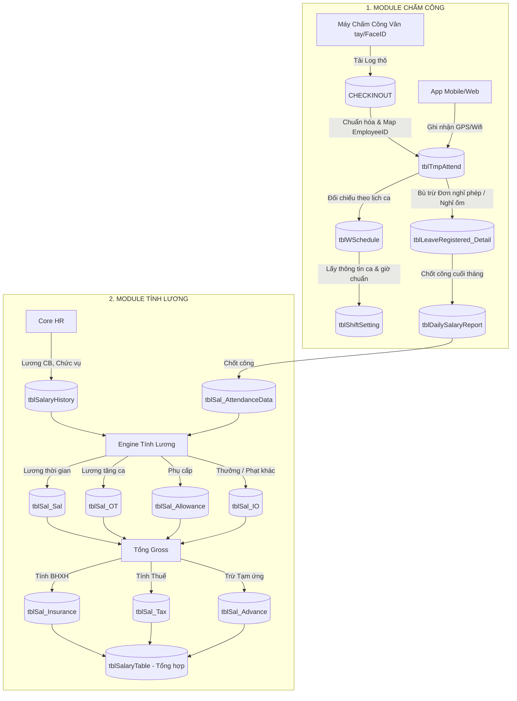

# BỨC TRANH TỔNG THỂ KIẾN TRÚC: CHẤM CÔNG & TÍNH LƯƠNG

> **Tài liệu Dành cho Lập trình viên / Chuyên viên triển khai**
> Bản tóm tắt chuyên sâu về phân hệ Chấm Công (Timekeeping) và Tính Lương (Payroll) - Nơi biến thời gian làm việc thành thu nhập của nhân viên.

---

## 1. Mối Liên Hệ Giữa Chấm Công và Lương

Hai phân hệ này gắn chặt như hình với bóng. Chấm công cung cấp "Số lượng" (Ngày công, giờ tăng ca), còn Lương cung cấp "Đơn giá" (Lương cơ bản, Hệ số OT).

---

## 2. Phân Hệ Máy Chấm Công (Timekeeping)

**Bản chất:** Lọc hàng ngàn dữ liệu quẹt thẻ "rác" thành những con số gọn gàng, có ý nghĩa cho việc tính tiền.

### A. Các Bảng Dữ Liệu Cốt Lõi

| Tên Bảng                        | Giải thích chức năng                                                                                                                                                                                                                                        |
| :------------------------------ | :---------------------------------------------------------------------------------------------------------------------------------------------------------------------------------------------------------------------------------------------------------- |
| **`CHECKINOUT`**                | **Dữ liệu thô từ máy.** Lưu mọi cú quẹt thẻ lấy trực tiếp từ máy chấm công vân tay/khuôn mặt (chứa `USERID` lưu trên máy, chưa phải mã `EmployeeID` thực tế).                                                                                                                          |
| **`tblTmpAttend`**              | **Dữ liệu chấm công chuẩn hóa.** Nhận dữ liệu từ `CHECKINOUT` (đã map `USERID` thành `EmployeeID`) và dữ liệu chấm công từ Mobile App/Web (chứa tọa độ GPS, SSID). Đây là nguồn dữ liệu chính để đối chiếu giờ công.                                                                                                                         |
| **`tblWSchedule`**              | **Lịch ca làm việc theo nhân viên.** Lưu `ScheduleDate`, `ShiftID`, `HolidayStatus`, `Approved`, `IsBeginPeriod`, `EmployeeID`. Đây là bảng cốt lõi để đối chiếu công với ca.                                                                               |
| **`tblShiftSetting`**           | **Định nghĩa ca.** Lưu `ShiftCode`, `ShiftName`, `WorkStart`, `WorkEnd`, `BreakStart`, `BreakEnd`, `Std_Hour_PerDays`, `OTBeforeStart`, `OTAfterEnd`. Dùng để tính giờ chuẩn, giờ OT và quy đổi phép theo ca.                                               |
| **`tblLeaveRegistered`**        | **Header đơn nghỉ phép.** Lưu thông tin chung của đơn như `IdentityID`, `EmployeeID`, `LeaveFromDate`, `LeaveToDate`, `LeaveCode`, `Approve_Status`, `Current_Approve_Level`, `Reason`, `CreateTime`, `isSubmit`, `isApprove`, `ApproveTime`, `RejectTime`. |
| **`tblLeaveRegistered_Detail`** | **Chi tiết dòng nghỉ.** Lưu mỗi ngày/giờ nghỉ trong đơn với `LeaveDate`, `LeaveFrom`, `LeaveTo`, `LeaveCode`, `LvAmount`, `Approve_Status`, `reason`, `ALLeaveHours`, `RejectedBy`.                                                                         |
| **`tblDailySalaryReport`**      | **Bảng Công.** Bảng tổng hợp công, chứa ngày công thực tế, giờ OT để chuẩn bị cho việc tính lương.                                                                                                                                                          |

> Ghi chú: Trong DB `Paradise_Dev`, các procedure chấm công như `Attendance_Daily_Detail` và `Raw_AttendanceData_Bydate` dùng `tblWSchedule` + `tblShiftSetting` làm nguồn ca, chứ không dùng bảng `SchClass` làm pipeline chính.

### B. Logic Tính Công Tiêu Biểu

1. Tìm cặp quẹt thẻ Đầu Tiên (IN) và Cuối Cùng (OUT) trong ngày từ bảng `tblTmpAttend`.
2. Đối chiếu `tblTmpAttend` với `tblWSchedule` và lấy thông tin ca từ `tblShiftSetting` để xác định giờ vào/ra, giờ chuẩn và giờ OT.
3. Nếu vắng mặt, tra cứu `tblLeaveRegistered_Detail` đã được duyệt trong đơn `tblLeaveRegistered`. Nếu có đơn phép năm -> Vẫn tính công theo `LvAmount` hoặc theo ngày phép và lịch ca. |

---

## 3. Phân Hệ Tính Lương (Payroll)

**Bản chất:** "Đồng tiền đi liền khúc ruột". Nó lấy chính sách lương nhân với Bảng công để ra số tiền cuối cùng.

### A. Các Bảng Dữ Liệu Cốt Lõi (Đã chuẩn hóa theo chuẩn Paradise HR)

Hệ thống Paradise phân rã quá trình tính lương thành nhiều bảng chi tiết (Data Marts) theo từng nhóm nghiệp vụ, sau đó mới tổng hợp lại. Điều này giúp hệ thống chạy nhanh, dễ bảo trì và dễ audit.

| Tên Bảng                    | Giải thích chức năng                                                                                                                                                 |
| :-------------------------- | :------------------------------------------------------------------------------------------------------------------------------------------------------------------- |
| **`tblSalaryHistory`**      | **Hồ sơ Lương.** Lưu mức lương, ngạch bậc, và lịch sử thay đổi lương của nhân viên.                                                                                  |
| **`tblSal_AttendanceData`** | **Dữ liệu Công chuẩn bị tính lương.** Kéo từ `tblDailySalaryReport` sang để chốt số liệu công cho kỳ lương, tránh bị ảnh hưởng nếu dữ liệu máy chấm công bị sửa đổi. |
| **`tblSal_Sal`**            | **Lương Thời Gian.** Kết quả tính toán tiền lương theo ngày công thực tế (Base Salary \* Working Days).                                                              |
| **`tblSal_OT`**             | **Lương Tăng Ca.** Kết quả tính tiền làm thêm giờ theo các hệ số (1.5, 2.0, 3.0...).                                                                                 |
| **`tblSal_Allowance`**      | **Phụ Cấp.** Các khoản phụ cấp (cố định hoặc theo ngày công như tiền cơm, xăng xe).                                                                                  |
| **`tblSal_IO`**             | **Thu nhập/Khấu trừ Khác (In/Out).** Thưởng đột xuất, phạt vi phạm, hoặc các khoản cộng trừ thủ công.                                                                |
| **`tblSal_Insurance`**      | **Bảo Hiểm.** Số tiền trích nộp BHXH, BHYT, BHTN của NLĐ và Công ty.                                                                                                 |
| **`tblSal_Tax`**            | **Thuế TNCN.** Số thuế phải nộp sau khi đã tính giảm trừ gia cảnh.                                                                                                   |
| **`tblSal_Advance`**        | **Tạm Ứng.** Tiền nhân viên đã ứng trước trong tháng.                                                                                                                |
| **`tblSalaryTable`**        | **Bảng Lương Tổng Hợp.** (Thành phẩm cuối cùng). Chứa toàn bộ cột tiền Gross, Net, các khoản trừ được gom lại từ các bảng chi tiết bên trên.                         |
| **`tblSal_Lock`**           | **Khóa Bảng Lương.** Lưu trạng thái chốt/khóa dữ liệu của từng tháng để bảo vệ tính toàn vẹn của dữ liệu quá khứ.                                                    |

### B. Công Thức Tính Lương Bất Di Bất Dịch

Hệ thống tính lương của mọi công ty đều xoay quanh công thức ngầm định này:

1. **Lương thời gian:** `(Lương cơ bản / Số ngày công chuẩn của tháng) * Số ngày công thực tế (Từ tblDailySalaryReport)`
2. **Tiền Tăng Ca (OT):** `(Lương cơ bản / Ngày công chuẩn / 8 giờ) * Số giờ OT * Hệ số (VD: 1.5 ngày thường, 2.0 Chủ nhật)`
   - Hoặc quy đổi theo `tblShiftSetting.Std_Hour_PerDays` khi ca làm việc không phải 8 giờ chuẩn.
3. **Tổng Thu Nhập (Gross):** `Lương thời gian + Tiền OT + Phụ Cấp`
4. **Các Khoản Trừ:**
   - **Bảo hiểm:** BHXH (8%), BHYT (1.5%), BHTN (1%) tính trên Lương đóng BHXH.
   - **Thuế TNCN:** Tính theo lũy tiến từng phần, sau khi đã trừ đi Giảm trừ bản thân và Người phụ thuộc (Từ `tblFamilyInfo`).
5. **Thực Lãnh (Net):** `Tổng Thu Nhập - Các Khoản Trừ - Tạm Ứng`

### C. Khái niệm: Chốt/Khóa Bảng Lương (Lock Payroll)

Vì dữ liệu nhân sự (Lương cơ bản, Chức vụ) thay đổi liên tục, bảng lương hàng tháng sau khi chốt xong **bắt buộc phải được Khóa (Lock)**.

- Khi đã Lock, mọi thay đổi về Lương cơ bản hay Ngày công của nhân viên trong quá khứ sẽ bị chặn lại, hoặc không làm thay đổi bảng lương của tháng đó nữa. Điều này đảm bảo tính toàn vẹn của dữ liệu Kế toán.
